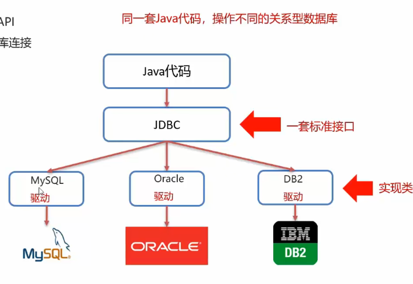

# JDBC

参考视频：https://www.bilibili.com/video/BV1s3411K7jH?t=503.0

### JDBC简介

- JDBC（Java DataBase Conectivity） 就是使用java操作关系型数据库的一套api。同一套java代码，操作不同的关系型数据库（接口）。
  

- **JDBC使用基本步骤**

  1. 导入驱动 jar 包

  2. 注册驱动
     ```java
     Class.forName("com.mysql.jdbc.Driver")
     ```
  
  3. 获取连接
     ```java
     Connection connection = DriverManager.getConnection(url, username, password);
     ```
  
  4. 定义 SQL 语句
     ```java
     String sql = "update...";
     ```
  
  5. 获取执行 SQL 对象
     ```java
     Statement stmt = connection.createStatement();
     ```
  
  6. 执行 SQL
     ```java
     stmt.executeUpdate(sql);
     ```
  7. 处理返回结果
  8. 释放资源
     ```java
     stmt.close;
     connection.close;
     ```


### DriverManager（驱动管理类）

- **作用:**

  1. **注册驱动**

     - 在 `com.mysql.jdbc.Driver1` 中有静态代码块，类被加载时会自动执行，而其中 `DriverManager` 会注册驱动
       ```java
       package com.mysql.jdbc;
       
       public class Driver implements java.sql.Driver {
           // 这是静态代码块，类被加载时会自动执行，且只执行一次
           static {
               try {
                   java.sql.DriverManager.registerDriver(new Driver());
               } catch (SQLException E) {
                   throw new RuntimeException("Can't register driver!");
               }
           }
          
           // ...
       }
       ```

       - 所以才能用 `Class.forName("com.mysql.jdbc.Driver")` 注册驱动
       - MySQL 5之后的驱动包可以省略注册驱动

  2. **获取数据库连接**

     - `Connection connection = DriverManager.getConnection(url, username, password);` 
     - 使用 SSL 更安全，但是性能会降低

### Connection（数据库连接(会话)对象）

- **作用：**

  1. **获取执行 SQL 的对象**

     - 获取普通执行 SQL 对象
       ```java
       Statement createStatement()
       ```
  
     - 预编译 SQL 的执行 SQL 对象：防止 SQL 注入
       ```java
       PreparedStatement prepareStatement(sql)
       ```
  
     - 执行存储过程的对象
  
       ```java
       CallableStatement prepareCall(sql)
       ```
  
  2. **管理事务**
  
     - MySQL 事务管理
       - *开启事务*：`BEGIN; / START TRANSACTION;`
       - *提交事务*：`COMMIT;`（MySQL默认自动提交事务）
       - *回滚事务*：`ROLLBACK;`
  
     - JDBC 事务管理（Connection接口中定义了3个对应的方法）
       - *开启事务*：`setAutoCommit(boolean autoCommit)`：true 为自动提交事务；false为手动提交事务，即为开启事务
       - *提交事务*：`commit()`
       - *回滚事务*：`rollback()`
     
     - 代码示例（利用异常处理）
       ```java
       String sql1 = "...";
       String sql2 = "...";
       
       Statement stmt = connection.createStatement();
       
       try{
           // 开启事务
       	connection.setAutoCommit(false);
           
           int count1 = stmt.executeUpdate(sql1);
       	int count2 = stmt.executeUpdate(sql2);
           
           // 提交事务
           connection.commit();
       } catch(Exception e){
           // 回滚事务
           connection.rollback();
           
           e.printStackTrace();
       }
       ```


### Statement

- **作用：**

  1. 执行 SQL 语句

     - **`int executeUpdate(sql)`**：执行 DML、DDL语句

       > 返回值：(1) DML 语句影响的行数 (2) DDL 语句执行后，执行成功也可能返回0

     - **`ResultSet executeQuery(sql)`**：执行 DQL 语句

       > 返回值：查询集合对象

     > 补充：
     > |         | 含义                                         | 作用                         | 命令                                                         |
     > | ------- | -------------------------------------------- | ---------------------------- | ------------------------------------------------------------ |
     > | **DDL** | 数据定义语言<br />Data Definition Language   | 用来定义数据库的结构         | CREATE：创建（建库、建表）。<br/>ALTER：修改（加字段、改字段类型）。<br/>DROP：删除（删库、删表）。<br/>TRUNCATE：清空表（保留表结构，删除全部数据） |
     > | **DML** | 数据操纵语言<br />Data Manipulation Language | 用来对表里的数据进行改变     | INSERT：插入数据<br/>UPDATE：更新数据<br/>DELETE：删除数据   |
     > | **DQL** | 数据查询语言<br />Data Query Language        | 用来从数据库中获取数据，只读 | SELECT                                                       |

  ​     
  
  