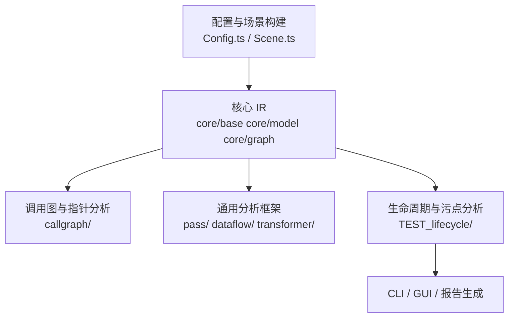
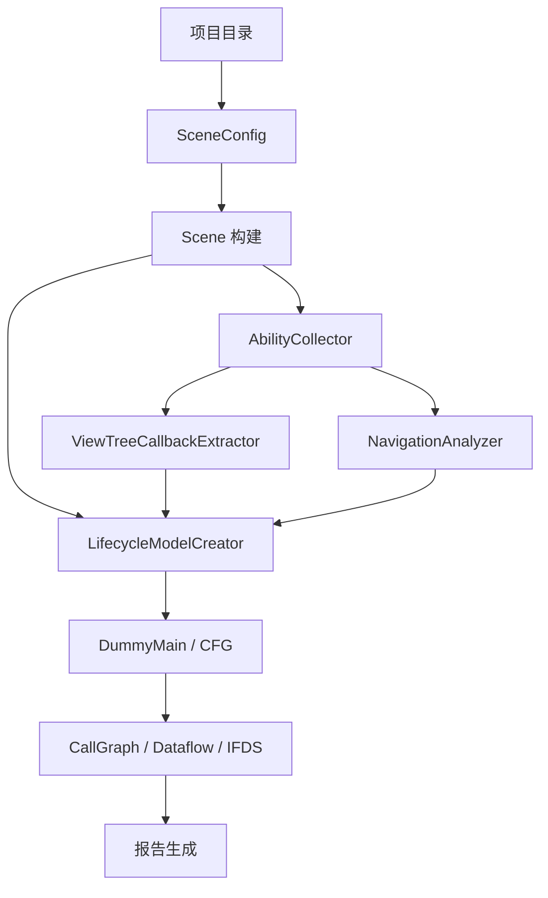

# ArkAnalyzer 面试详解文档

这是一份基于源码整理的项目讲解文档，目标是帮助在面试中把 ArkAnalyzer 讲清楚、讲深入，并且能回答“为什么这么设计”“关键实现在哪里”“有哪些边界和限制”这类细节问题。

如果只用一句话概括这个项目，可以这样说：

> ArkAnalyzer 是一个面向 ArkTS / HarmonyOS 应用的静态程序分析框架，它先把工程构造成完整的中间表示 Scene，再在此基础上做调用图、指针分析、控制流图、生命周期建模、UI 回调提取、导航分析和污点分析，最终支持生成可分析的虚拟入口 DummyMain。

---

## 1. 先给面试官的总述

这个项目不是一个单点工具，而是一个完整的分析框架。它的主线可以分成三层：

1. 先把 HarmonyOS / ArkTS 工程解析成可分析的程序模型，也就是 Scene。
2. 在 Scene 上建立控制流、调用图、类型信息和各种 IR 结构。
3. 再通过 DummyMain 把没有传统 `main()` 的鸿蒙应用，折叠成一个可以被静态分析算法遍历的统一入口。

更具体地说，项目最核心的价值是解决两个问题：

1. 鸿蒙应用没有天然的 main 入口，生命周期分散在 `onCreate`、`onForeground`、`build()`、`onClick()` 这类回调里，静态分析很难起步。
2. 页面跳转和 UI 事件会把执行路径拆散，如果不把这些事件建模进统一入口，就很容易漏掉数据流。

因此，ArkAnalyzer 的核心思路就是：**把真实世界里分散的生命周期行为，抽象成一个人为构造的、有限且可控的控制流图。**

---

## 2. 仓库结构怎么看

从代码组织上看，项目主入口在 [src/index.ts](/home/lyr/Main/Projects/typescript_lifecycle/arkanalyzer-master/arkanalyzer-master/src/index.ts)，而真正与面试相关的生命周期增强模块在 [src/TEST_lifecycle/index.ts](/home/lyr/Main/Projects/typescript_lifecycle/arkanalyzer-master/arkanalyzer-master/src/TEST_lifecycle/index.ts)。

你可以把整个仓库理解成下面这几个层次：



你面试时可以把目录解释为：

- `src/core/` 是 IR 和基础数据结构，负责“怎么表示程序”。
- `src/callgraph/` 是调用图与指针分析，负责“动态调用能指到哪里”。
- `src/pass/` 是通用分析框架，负责“怎么把分析作为 pass 跑起来”。
- `src/TEST_lifecycle/` 是生命周期建模、路由、UI 回调和污点分析的应用层扩展。
- `src/save/` 是各种输出格式，把分析结果打印成文本、JSON、HTML、DOT 等。
- `scripts/` 是实验脚本和批量分析入口。

---

## 3. 这项目到底在分析什么

ArkAnalyzer 不是只看语法树，而是往下构建成“程序语义”层面的模型。它的分析对象主要包括：

- `ArkFile`：源文件级别对象。
- `ArkClass`：类。
- `ArkMethod`：方法。
- `ArkField`：字段。
- `Cfg` / `BasicBlock`：控制流图。
- `ViewTree`：UI 构建树。
- `CallGraph`：调用图。
- `PtsSet` / `Pag`：指针分析结果。

从面试角度，你可以把它说成：

> 它是一个“从源代码解析到中间表示，再从中间表示做跨函数、跨对象、跨回调分析”的静态分析平台。

---

## 4. 配置与场景构建：为什么 `Scene` 是第一层核心

### 4.1 `SceneConfig` 的职责

配置逻辑在 [src/Config.ts](/home/lyr/Main/Projects/typescript_lifecycle/arkanalyzer-master/arkanalyzer-master/src/Config.ts)。这个类负责把项目路径、SDK、文件列表、语言标签这些信息组织起来。

它做的事情主要有：

- 读取默认配置文件 `config/arkanalyzer.json`。
- 读取项目的 `build-profile.json5`、`oh-package.json5` 和 `tsconfig.json`。
- 收集项目源码文件。
- 支持为文件附加语言标签。
- 支持从 JSON 配置文件创建 Scene 配置。

你可以把 `SceneConfig` 理解为“分析前的项目说明书”。它解决的是“要分析哪些文件、用哪些 SDK、怎样识别扩展名、从哪里读路径映射”这类问题。

### 4.2 `Scene` 的职责

真正的全局模型在 [src/Scene.ts](/home/lyr/Main/Projects/typescript_lifecycle/arkanalyzer-master/arkanalyzer-master/src/Scene.ts)。

`Scene` 是整个项目里最重要的容器之一，它保存了：

- 项目名、项目路径、文件列表。
- module 和 SDK 的映射。
- 文件、命名空间、类、方法的全局表。
- 已经推断的类型信息。
- 依赖解析、导入导出关系和构建阶段。

可以把它理解为“整个被分析程序的内存数据库”。

### 4.3 `Scene` 的构建流程

`Scene` 的主流程大体是：

1. 读取 `SceneConfig`。
2. 解析构建配置、`oh-package.json5`、`tsconfig.json`、模块映射。
3. 装载 SDK，并先对 SDK 做类型推断和全局 API 合并。
4. 递归解析项目源码，构造 `ArkFile`、`ArkClass`、`ArkMethod`。
5. 构建所有方法体、CFG，并更新默认构造函数。

源码里最有代表性的两个入口是：

- `buildSceneFromProjectDir(sceneConfig)`：从项目目录构建。
- `buildSceneFromFiles(sceneConfig)`：从指定文件列表构建。

### 4.4 `Scene` 为什么复杂

因为它不只是简单遍历文件，它还要处理：

- `build-profile.json5` 里的模块路径映射。
- `oh-package.json5` 里的依赖、override 和 overrideDependencyMap。
- `tsconfig.json` 的 `baseUrl` 和 `paths`。
- 递归依赖解析，避免重复构建。
- SDK 注入与内置库处理。
- 默认构造函数补全，以及 `super` 调用替换。

这意味着 `Scene` 实际上承担了“解析器、索引器、依赖管理器、类型载体”四种角色。

---

## 5. `DummyMainCreater`：原始虚拟入口是怎么生成的

原始逻辑在 [src/core/common/DummyMainCreater.ts](/home/lyr/Main/Projects/typescript_lifecycle/arkanalyzer-master/arkanalyzer-master/src/core/common/DummyMainCreater.ts)。这是整个生命周期建模的源头。

### 5.1 这个类解决的问题

鸿蒙应用没有传统 `main()`，真实入口被拆在：

- Ability 生命周期函数。
- Component 生命周期函数。
- UI 回调。
- 静态初始化。

静态分析想从头遍历整个程序，必须人为造一个入口。`DummyMainCreater` 的作用就是把这些入口拼成一个方法。

### 5.2 它收集哪些入口

构造函数里会收集三类方法：

1. `getMethodsFromAllAbilities()`：找所有继承 Ability 基类的类，并收集它们的生命周期方法。
2. `getEntryMethodsFromComponents()`：找 `CustomComponent`、`ViewPU`，或带 `@Component` 装饰器的组件，收集生命周期方法。
3. `getCallbackMethods()`：收集 UI 事件回调。

其中 Ability 的识别是通过继承链判断，基础类包括：

- `UIAbility`
- `Ability`
- `FormExtensionAbility`
- `UIExtensionAbility`
- `BackupExtensionAbility`

Component 则通过：

- 直接继承 `CustomComponent` / `ViewPU`
- 或者带 `@Component`

### 5.3 DummyMain 是怎么搭出来的

`createDummyMain()` 做了三件关键事：

1. 创建一个虚拟文件 `@dummyFile`。
2. 在这个文件里创建一个虚拟类 `@dummyClass`。
3. 在虚拟类里创建一个方法 `@dummyMain`，并为它构造 CFG 和方法体。

最后会把这个方法加入 `Scene.methodsMap`，让后续分析都可以把它当成真实入口。

### 5.4 DummyMain 的控制流结构

原版 DummyMain 的核心结构是：

```mermaid
flowchart TD
    A[静态初始化] --> B[count = 0]
    B --> C[while(true)]
    C --> D1[if count == 1\nAbility/Component 调用]
    D1 --> D2[if count == 2\nAbility/Component 调用]
    D2 --> D3[if count == 3\nUI 回调]
    D3 --> R[return]
    R -.-> C
```

源码里这个 `while(true)` 是通过 `ArkIfStmt` + 条件恒真表达式模拟出来的。每个分支内部会：

- 先实例化类对象。
- 再调用构造函数。
- 再调用对应生命周期方法。

### 5.5 这里最值得面试官追问的细节

#### 1）为什么要先实例化对象？

因为很多生命周期方法不是静态的，是实例方法。静态分析要保留 `this` 关系，就必须在 DummyMain 里显式构造对象，并用 `ArkInstanceInvokeExpr` 调用。

#### 2）为什么还要显式调用构造函数？

因为对象初始化逻辑可能在构造函数里，后面的字段值、资源申请、监听注册都依赖构造阶段。只做 `new` 不够，必须补上构造调用。

#### 3）为什么要给参数也生成对象？

因为生命周期方法往往带参数，比如 `Want`、`WindowStage` 等。如果参数类型已知，DummyMain 会给它造一个 `new` 出来的局部变量，以便后续数据流分析可以继续传播。

#### 4）为什么要用 `count == n` 的分支？

因为这样可以把多个生命周期入口放在一个方法里，并让每个入口形成不同分支。这样做的本质是把“事件驱动”改造成“显式控制流”。

### 5.6 原版实现的局限

原版 `DummyMainCreater` 仍然有明显局限：

- 它默认是单个场景思路，不能很好覆盖所有 Ability。
- UI 回调收集比较粗，只是按名称收集，不区分控件上下文。
- 跳转关系没有细化建模。
- 某些参数类型在 ABC 场景下会丢失，只能从父类补。

这些问题就是 `TEST_lifecycle` 扩展模块的出发点。

---

## 6. `TEST_lifecycle`：面试最值得讲的增强模块

入口在 [src/TEST_lifecycle/index.ts](/home/lyr/Main/Projects/typescript_lifecycle/arkanalyzer-master/arkanalyzer-master/src/TEST_lifecycle/index.ts)。

### 6.1 这个模块的定位

它本质上是一个“更接近真实鸿蒙应用”的生命周期建模层。相比原版 `DummyMainCreater`，它把三个方向补强了：

1. 多 Ability 支持。
2. 更精细的 UI 回调提取。
3. 页面跳转 / 导航分析。

它的配置类型定义在 [src/TEST_lifecycle/LifecycleTypes.ts](/home/lyr/Main/Projects/typescript_lifecycle/arkanalyzer-master/arkanalyzer-master/src/TEST_lifecycle/LifecycleTypes.ts)。

### 6.2 `LifecycleTypes.ts` 的关键数据结构

这个文件定义了整个扩展模块的“语义合同”。最重要的是以下几类：

- `AbilityLifecycleStage`
- `ComponentLifecycleStage`
- `AbilityInfo`
- `ComponentInfo`
- `UICallbackInfo`
- `AbilityNavigationTarget`
- `NavigationType`
- `LifecycleModelConfig`
- `BoundsConfig`

#### 6.2.1 生命周期阶段

Ability 的生命周期阶段被显式枚举成：

- `onCreate`
- `onWindowStageCreate`
- `onForeground`
- `onBackground`
- `onWindowStageDestroy`
- `onDestroy`

Component 的生命周期阶段包括：

- `aboutToAppear`
- `build`
- `aboutToDisappear`
- `onPageShow`
- `onPageHide`

这样做的好处是，后续构造 DummyMain 时不用依赖字符串拼接，而是能按固定顺序生成调用序列。

#### 6.2.2 `LifecycleModelConfig`

配置里最重要的是这些开关：

- 是否启用多 Ability 导航建模。
- 是否启用精细化 UI 回调。
- 是否启用 ViewTree 解析。
- 生命周期方法的调用顺序。
- 最大导航深度。
- 三条有界约束。

默认值里最重要的一点是：`maxCallbackIterations = 1`。也就是说默认会把循环展开成单次，目标是让 DummyMain 的 CFG 变成 DAG，降低不动点求解的复杂度。

### 6.3 `AbilityCollector.ts`：谁是 Ability，谁是 Component

实现文件在 [src/TEST_lifecycle/AbilityCollector.ts](/home/lyr/Main/Projects/typescript_lifecycle/arkanalyzer-master/arkanalyzer-master/src/TEST_lifecycle/AbilityCollector.ts)。

这个类是整个扩展模块的“分类器”和“关系构建器”。它做四件事：

1. 读取项目中的 `module.json5`。
2. 识别 Ability。
3. 识别 Component。
4. 建立 Ability 到 Component 的导航和绑定关系。

#### 6.3.1 module.json5 的加载方式

它会从项目根目录递归查找 `module.json5`，深度最多 5 层，跳过 `node_modules` 和隐藏目录。

然后用一个非常轻量的方式把 JSON5 转成 JSON：

- 去单行注释。
- 去多行注释。
- 去尾随逗号。
- 把单引号转双引号。

这说明它的 parser 是“工程上够用”的简化实现，不是严格 JSON5 解析器。

#### 6.3.2 如何判断一个类是不是 Ability

判断逻辑是：

1. 直接父类是不是 Ability 基类。
2. 否则沿继承链向上找。

基础类包括：

- `UIAbility`
- `Ability`
- `UIExtensionAbility`
- `FormExtensionAbility`
- `BackupExtensionAbility`

#### 6.3.3 如何判断一个类是不是 Component

判断逻辑是：

1. 直接继承 `CustomComponent` / `ViewPU`。
2. 或者有 `@Component` 装饰器。

#### 6.3.4 如何收集生命周期方法

Ability 生命周期方法通过方法名映射到枚举：

- `onCreate`
- `onDestroy`
- `onWindowStageCreate`
- `onWindowStageDestroy`
- `onForeground`
- `onBackground`

Component 生命周期方法通过：

- `aboutToAppear`
- `aboutToDisappear`
- `build`
- `onPageShow`
- `onPageHide`

#### 6.3.5 入口 Ability 怎么找

它优先使用 `module.json5` 的 `mainElement`。如果项目没有成功解析出 module 配置，才退回到启发式规则：

- 类名包含 `Entry`
- 或类名包含 `Main`

这点在面试里很重要，因为它说明项目不是纯规则匹配，而是兼顾配置驱动和启发式兜底。

#### 6.3.6 Ability 和 Component 之间怎么关联

如果 `NavigationAnalyzer` 解析出一个 `loadContent('pages/Index')` 之类的初始页面路径，`AbilityCollector` 会尝试把路径最后一段 `Index` 匹配到某个 Component。

这里的匹配逻辑很直接：

- 先取页面路径最后一段。
- 然后在已收集的 Component 中按 `component.name === pageName` 试图匹配。
- 也允许全路径一致时直接匹配。

这意味着它不是完整的路由系统恢复，而是“基于页面名和路径名的近似绑定”。

### 6.4 `ViewTreeCallbackExtractor.ts`：UI 回调怎么从树里提取出来

实现文件是 [src/TEST_lifecycle/ViewTreeCallbackExtractor.ts](/home/lyr/Main/Projects/typescript_lifecycle/arkanalyzer-master/arkanalyzer-master/src/TEST_lifecycle/ViewTreeCallbackExtractor.ts)。

这个类是对原始“按名字扫 onClick”的增强版。它不是只看方法名，而是遍历 `ViewTree` 的节点，把控件、事件、状态依赖一起抽出来。

#### 6.4.1 它解决什么问题

原始 `DummyMainCreater` 只知道“这个类里有一个 onClick 方法”。

但面试里更有说服力的说法是：

> 真正的 UI 回调并不是孤立函数，它属于某个具体控件，依赖某些状态变量，甚至可能由 `@Builder` 或匿名方法间接传入。

所以扩展版要做的是“上下文化”回调提取。

#### 6.4.2 它识别哪些 UI 事件

支持的事件名包括：

- `onClick`
- `onTouch`
- `onChange`
- `onAppear`
- `onDisAppear`
- `onDragStart`
- `onDrop`
- `onFocus`
- `onBlur`
- `onAreaChange`
- `onSelect`
- `onSubmit`
- `onScroll`

#### 6.4.3 回调怎么解析

解析顺序是：

1. 从节点属性中找到事件属性。
2. 先尝试从关联值中解析出 `MethodSignature`。
3. 如果是 `ArkInstanceFieldRef`，把字段名当作方法名尝试匹配。
4. 如果是字符串常量，把字符串当作方法名尝试匹配。
5. 如果都失败，再尝试从语句中解析 lambda。

#### 6.4.4 为什么要有 `visited` 集合

因为 `ViewTree` 可能包含自引用，尤其是 `@Builder` 里绑定菜单或递归 UI 片段的时候。如果不做 visited 防护，递归遍历会无限循环。

源码里明确加了 `visited: Set<ViewTreeNode>`，这是一个很典型的工程级防护点。

#### 6.4.5 这个模块的局限

它对 lambda 的精确解析还没有完全做完，很多情况只做到了“尽量识别”，但没有完整恢复语义关联。这一点在源码注释里也明确留下了 TODO。

### 6.5 `NavigationAnalyzer.ts`：页面跳转怎么分析

实现文件是 [src/TEST_lifecycle/NavigationAnalyzer.ts](/home/lyr/Main/Projects/typescript_lifecycle/arkanalyzer-master/arkanalyzer-master/src/TEST_lifecycle/NavigationAnalyzer.ts)。

这是整个项目里很值得面试官追问的部分，因为它把“业务导航”纳入了静态分析。

#### 6.5.1 它识别哪些跳转

支持的导航调用包括：

- `windowStage.loadContent()`
- `router.pushUrl()`
- `router.replaceUrl()`
- `router.back()`
- `context.startAbility()`
- `NavPathStack.pushPath()`
- `NavPathStack.replacePath()`
- `NavPathStack.pushPathByName()`
- `NavPathStack.replacePathByName()`

#### 6.5.2 它的分析方式

核心步骤是：

1. 遍历类的所有方法。
2. 遍历方法 CFG 中的所有语句。
3. 检查每条语句是否包含调用表达式。
4. 根据方法名分发到不同的处理函数。

#### 6.5.3 它怎么从参数里恢复目标页面

它支持三类情况：

- 直接字符串常量，比如 `router.pushUrl({ url: 'pages/Detail' })`。
- `Local` 变量，比如先构造一个对象再传参。
- 匿名对象 / 匿名类字段，比如从 `NavPathInfo` 的 `name` 字段取值。

它会尝试追踪：

- 字段赋值。
- 对象初始化。
- 匿名类字段。

#### 6.5.4 这个分析的边界在哪里

它不是完整的数据流求值器。它的主要限制是：

- 对字符串常量最强。
- 对变量和对象字面量做有限回溯。
- 对复杂条件拼接、函数返回传播、深层跨函数值传递，解析能力有限。

所以它更适合作为“导航结构提取器”，而不是精确的路径符号执行器。

### 6.6 `LifecycleModelCreator.ts`：扩展版 DummyMain 的核心

实现文件是 [src/TEST_lifecycle/LifecycleModelCreator.ts](/home/lyr/Main/Projects/typescript_lifecycle/arkanalyzer-master/arkanalyzer-master/src/TEST_lifecycle/LifecycleModelCreator.ts)。

这是整个项目里最应该重点讲的文件，因为它把前面的分析结果真正“折叠”为可分析入口。

#### 6.6.1 它相对原版改了什么

和 `DummyMainCreater` 相比，它主要做了四个增强：

1. 支持多个 Ability，而不是只围绕一个场景。
2. 支持更精细的 UI 回调提取。
3. 支持页面跳转/导航关系的增强建模。
4. 支持有界展开，避免 CFG 无限增长。

#### 6.6.2 它的总流程

`create()` 方法是总入口，执行顺序是：

1. 收集所有 Ability 和 Component。
2. 如果启用了 ViewTree 解析，就提取 UI 回调。
3. 创建虚拟文件、虚拟类、虚拟方法。
4. 构建 DummyMain CFG。
5. 注册回 Scene。

#### 6.6.3 为什么要把入口 Ability 和 `@Entry` Component 排前面

源码里会先排序：

- `isEntry` 的 Ability 排前面。
- `@Entry` 的 Component 排前面。

这样做的目的很直接：让 DummyMain 更接近真实启动顺序，增强分析路径的可解释性。

#### 6.6.4 它的 CFG 结构和原版有什么差别

原版是 `while(true)` 形式。扩展版改成“展开式 CFG”：

- 用 `maxCallbackIterations` 控制展开轮数。
- 每一轮里面按 Ability 和 Component 顺序添加分支。
- 最后把所有末尾块直接连到 return 块。

这意味着默认 `maxCallbackIterations = 1` 时，CFG 没有回边，是 DAG。这对 IFDS 或其他不动点分析非常友好。

#### 6.6.5 它怎样建模 Ability

对每个 Ability，它会：

1. 创建实例。
2. 调用构造函数。
3. 按配置的生命周期顺序调用方法。
4. 如果这个 Ability 关联了 Component，还会把 Component 的生命周期和 UI 回调一起挂进来。

#### 6.6.6 它怎样建模 Component

对每个 Component，它会：

1. 创建实例。
2. 调用构造函数。
3. 调用 `aboutToAppear`、`build`、`onPageShow`、`aboutToDisappear` 等方法。
4. 如果启用了精细回调建模，就继续调用提取出来的 UI 回调方法。

#### 6.6.7 它怎样处理参数

参数生成逻辑是非常重要的细节：

- 如果参数是类类型，就生成 `new Xxx()`。
- 如果类型未知，会尝试从父类同名方法中补参数类型。
- 如果还是未知，就跳过该参数。
- 对 UI 回调参数，它会根据事件类型推断，比如 `onClick` 对应 `ClickEvent`，`onTouch` 对应 `TouchEvent`。

这说明项目不是只“造壳”，而是真的尽量让 DummyMain 语义闭合。

#### 6.6.8 它如何避免重复建模

扩展版里有 `classInstanceMap`，按类签名缓存实例 Local。这样相同类不会在每个分支里反复创建不同局部变量。

#### 6.6.9 它如何把语句挂回 CFG

在 CFG 构造完后，它会给所有语句补 `cfg` 引用，并更新 `stmt -> block` 的映射。这一步对后续数据流分析、源码定位和报告生成都很重要。

### 6.7 `BoundsConfig`：为什么要做有界化

这是面试非常加分的一点，因为它说明项目不是“能跑就行”，而是考虑了静态分析的可终止性。

三条有界约束分别是：

1. 单条数据流最多经过多少个 Ability。
2. DummyMain 的回调循环展开多少轮。
3. 单条数据流最多经过多少次导航跳转。

默认值是：

- `maxCallbackIterations = 1`
- `maxAbilitiesPerFlow = 3`
- `maxNavigationHops = 5`

这类设计在分析框架里很常见，本质上是在“精度”和“可终止性”之间做工程折中。

---

## 7. CLI 和报告层：怎么把分析结果交给用户

CLI 入口在 [src/TEST_lifecycle/cli/cli.ts](/home/lyr/Main/Projects/typescript_lifecycle/arkanalyzer-master/arkanalyzer-master/src/TEST_lifecycle/cli/cli.ts)，统一导出在 [src/TEST_lifecycle/cli/index.ts](/home/lyr/Main/Projects/typescript_lifecycle/arkanalyzer-master/arkanalyzer-master/src/TEST_lifecycle/cli/index.ts)。

### 7.1 `LifecycleAnalyzer.ts`

实现文件是 [src/TEST_lifecycle/cli/LifecycleAnalyzer.ts](/home/lyr/Main/Projects/typescript_lifecycle/arkanalyzer-master/arkanalyzer-master/src/TEST_lifecycle/cli/LifecycleAnalyzer.ts)。

它把整个分析流程封装成一个高层 API，面试时可以把它说成：

> 它是生命周期分析的 orchestration 层，负责把 Scene 构建、Ability/Component 收集、UI 回调提取、导航分析、DummyMain 生成、资源泄漏检测和 IFDS 污点分析串成一条流水线。

它的工作顺序是：

1. 验证项目路径。
2. 构建 Scene。
3. 收集 Ability。
4. 收集 Component。
5. 提取 UI 回调。
6. 分析导航。
7. 生成 DummyMain。
8. 资源泄漏检测。
9. 完整 IFDS 污点分析。
10. 扫描 Source/Sink 位置。
11. 汇总成统一的 `AnalysisResult`。

这里有几个很值得一提的实现细节：

- 它对每个阶段都单独计时。
- 它会把异常降级成带 warning/error 的结果，而不是直接崩掉。
- 它支持通过 `bounds` 传参，把有界约束一路传到生命周期模型和污点分析里。

### 7.2 `ReportGenerator.ts`

实现文件是 [src/TEST_lifecycle/cli/ReportGenerator.ts](/home/lyr/Main/Projects/typescript_lifecycle/arkanalyzer-master/arkanalyzer-master/src/TEST_lifecycle/cli/ReportGenerator.ts)。

它支持四种输出格式：

- `json`
- `text`
- `html`
- `markdown`

这说明项目不仅能做分析，还考虑到了工程化输出。

文本报告里会包含：

- 项目信息。
- 统计摘要。
- Source / Sink 位置。
- 泄漏详情。
- 有界约束。
- Ability 列表。
- Component 列表。
- UI 回调统计。
- 导航关系。
- DummyMain 信息。
- 耗时统计。
- 警告和错误。

### 7.3 `scripts/test-quick.ts`

快速测试脚本在 [scripts/test-quick.ts](/home/lyr/Main/Projects/typescript_lifecycle/arkanalyzer-master/arkanalyzer-master/scripts/test-quick.ts)。

它做的事情很简单，但很适合面试中说明“项目如何验证”：

- 预置一组项目路径。
- 逐个调用 `LifecycleAnalyzer.analyze()`。
- 打印 source / sink / resource leak 的统计。

这说明项目并不是只停留在代码层，而是有一套批处理验证的入口。

---

## 8. 这个项目的分析链路图

如果面试官让你现场画流程图，可以直接画这个：



你可以这样解释：

> Scene 负责把工程变成语义对象，AbilityCollector 和 ViewTreeCallbackExtractor 负责把运行时事件抽象出来，LifecycleModelCreator 负责把它们折叠成一个统一入口，最后再把入口交给数据流分析求解。

---

## 9. 面试官最可能问的细节问题

下面这部分非常适合背熟。

### 9.1 为什么要有 DummyMain，而不是直接从所有方法开始分析？

因为鸿蒙应用没有统一入口，生命周期和 UI 事件是分散的。如果直接从所有方法开始，会带来两个问题：

1. 分析入口太多，结果难以解释。
2. 无法把“系统驱动的调用顺序”统一起来。

DummyMain 把这些事件串成显式 CFG，等于给分析器造了一个统一起点。

### 9.2 为什么扩展版要把 CFG 变成 DAG？

因为 `while(true)` 会让静态分析更容易陷入不动点迭代和路径爆炸。默认把 `maxCallbackIterations` 设成 1，相当于单轮展开，CFG 变成 DAG，分析更容易终止，结果也更稳定。

### 9.3 `AbilityCollector` 为什么要先读 `module.json5`？

因为入口 Ability 在工程配置里通常已经写明，直接读配置比纯启发式更准。只有配置缺失时才用类名 `Entry/Main` 作为回退。

### 9.4 为什么 UI 回调要看 ViewTree？

因为真实 UI 回调不是散落在类里的独立函数，而是绑定在具体控件上的事件。ViewTree 能保留控件、属性、状态依赖和节点关系，比单看方法名更准确。

### 9.5 为什么 `ViewTreeCallbackExtractor` 要防止递归？

因为 `@Builder`、菜单绑定、自引用组件都可能造成树结构中的环。没有 visited 集合会无限递归。

### 9.6 `NavigationAnalyzer` 的 `loadContent` 为什么重要？

`loadContent` 决定了 Ability 启动后初始加载的是哪个页面。这个信息能把 Ability 和某个页面 Component 绑定起来，是从入口到页面的关键桥梁。

### 9.7 为什么要把 `aboutToDisappear` 也纳入 Component 生命周期？

因为资源释放逻辑常常在组件消失时触发，比如 `clearInterval()`、注销监听、释放句柄等。如果只看 `build` 和 `aboutToAppear`，会漏掉清理逻辑。

### 9.8 `LifecycleAnalyzer` 为什么要分阶段计时？

因为这类分析很容易慢在不同阶段。单独计时后，能快速判断瓶颈是在 Scene 构建、回调提取、导航分析，还是 DummyMain/污点分析。

### 9.9 这个项目目前最明显的限制是什么？

从源码看，主要限制有这些：

- `module.json5` 的 JSON5 解析是简化版，不是严格 parser。
- lambda 回调解析还不完整。
- 页面/组件绑定有启发式成分。
- 导航参数和对象初始化只能做有限回溯。
- 有些类型需要从父类或 SDK 补齐。

### 9.10 这个项目和普通 AST 工具的区别是什么？

普通 AST 工具主要看“语法长什么样”，而 ArkAnalyzer 关心的是“程序行为如何流动”。它会把语法进一步变成 IR、CFG、调用图和数据流事实，这才是静态分析的核心价值。

---

## 10. 你在面试里可以怎么讲这个项目

如果面试官只给你 1 到 2 分钟，你可以按这个顺序讲：

1. 先说项目定位：这是一个面向 ArkTS / HarmonyOS 的静态分析框架。
2. 再说核心难点：没有 main 入口，生命周期分散，UI 和导航会打散路径。
3. 再说解决方案：通过 `Scene` 建模工程，通过 `DummyMain` 统一入口，通过 `LifecycleModelCreator` 把 Ability、Component、UI 回调和导航折叠进 CFG。
4. 最后说工程化：CLI、报告、资源泄漏和 IFDS 污点分析都已经落地。

如果面试官继续追问，你就往下拆：

- `SceneConfig` 负责项目输入。
- `Scene` 负责全局语义对象。
- `DummyMainCreater` 是原始入口建模。
- `LifecycleModelCreator` 是增强版入口建模。
- `AbilityCollector`、`ViewTreeCallbackExtractor`、`NavigationAnalyzer` 分别负责能力、回调、路由。
- `LifecycleAnalyzer` 负责把整条流水线串起来。

---

## 11. 一份更像“答题稿”的总结

如果你想在面试里说得更像“懂源码的人”，可以用下面这段话：

> 这个项目的核心是把 HarmonyOS 应用从事件驱动模型转换成静态分析可处理的显式控制流模型。它先通过 `Scene` 把 ArkTS 工程解析成 IR，再通过 `DummyMainCreater` 和扩展版 `LifecycleModelCreator` 把 Ability 生命周期、Component 生命周期、UI 回调和导航跳转统一折叠到一个虚拟入口里。这样后续无论是调用图、数据流分析还是 IFDS 污点分析，都可以从一个可控的入口起步。项目的工程亮点在于既考虑了多 Ability、多页面、多回调的真实复杂度，也通过有界展开和约束参数保证了分析可终止、可落地。

---

## 12. 建议你重点记住的源码文件

如果面试前时间很紧，优先记这几个：

- [src/Config.ts](/home/lyr/Main/Projects/typescript_lifecycle/arkanalyzer-master/arkanalyzer-master/src/Config.ts)
- [src/Scene.ts](/home/lyr/Main/Projects/typescript_lifecycle/arkanalyzer-master/arkanalyzer-master/src/Scene.ts)
- [src/core/common/DummyMainCreater.ts](/home/lyr/Main/Projects/typescript_lifecycle/arkanalyzer-master/arkanalyzer-master/src/core/common/DummyMainCreater.ts)
- [src/TEST_lifecycle/LifecycleTypes.ts](/home/lyr/Main/Projects/typescript_lifecycle/arkanalyzer-master/arkanalyzer-master/src/TEST_lifecycle/LifecycleTypes.ts)
- [src/TEST_lifecycle/AbilityCollector.ts](/home/lyr/Main/Projects/typescript_lifecycle/arkanalyzer-master/arkanalyzer-master/src/TEST_lifecycle/AbilityCollector.ts)
- [src/TEST_lifecycle/ViewTreeCallbackExtractor.ts](/home/lyr/Main/Projects/typescript_lifecycle/arkanalyzer-master/arkanalyzer-master/src/TEST_lifecycle/ViewTreeCallbackExtractor.ts)
- [src/TEST_lifecycle/NavigationAnalyzer.ts](/home/lyr/Main/Projects/typescript_lifecycle/arkanalyzer-master/arkanalyzer-master/src/TEST_lifecycle/NavigationAnalyzer.ts)
- [src/TEST_lifecycle/LifecycleModelCreator.ts](/home/lyr/Main/Projects/typescript_lifecycle/arkanalyzer-master/arkanalyzer-master/src/TEST_lifecycle/LifecycleModelCreator.ts)
- [src/TEST_lifecycle/cli/LifecycleAnalyzer.ts](/home/lyr/Main/Projects/typescript_lifecycle/arkanalyzer-master/arkanalyzer-master/src/TEST_lifecycle/cli/LifecycleAnalyzer.ts)
- [src/TEST_lifecycle/cli/ReportGenerator.ts](/home/lyr/Main/Projects/typescript_lifecycle/arkanalyzer-master/arkanalyzer-master/src/TEST_lifecycle/cli/ReportGenerator.ts)

---

## 13. 补充：如果面试官问“你觉得这个项目还可以怎么改”

你可以从三个方向答：

1. 更强的语义恢复：把 lambda、匿名对象、复杂导航参数做更完整的数据流回溯。
2. 更强的入口建模：把 module.json5、router、页面栈和 Navigation 的信息进一步统一到一个全局入口图里。
3. 更强的性能控制：把有界约束做得更细，并结合缓存、增量分析和分模块分析减少重复构建。

这样答比较像“真的做过分析工具的人”，而不是只会背概念。
