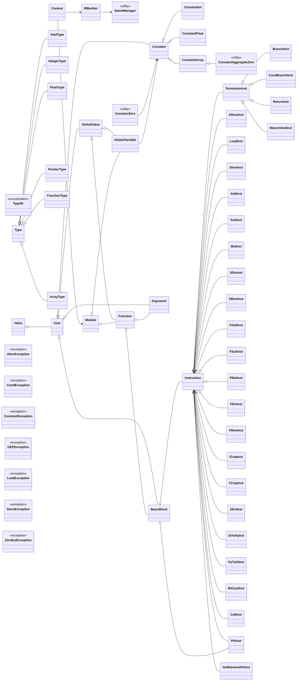

# SysY 编译器（NaryPorc）面试讲稿
- 前端：`src/main/antlr4/SysYLexer.g4` 和 `src/main/antlr4/SysYParser.g4`，由 ANTLR 生成词法/语法分析器，入口在 `Compiler.java`。
- 中间层（LL IR）：`src/main/java/com/compiler/ll` 包含 `Module`、`BasicBlock`、`Instruction`、`Value` 等核心数据结构。
- 优化与分析：`src/main/java/com/compiler/pass` 内实现了 Dominate 分析、Mem2Reg（SSA）、常量传播、死码消除、循环不变代码提取等多个 Pass。
- MIR（中间中级表示）：`src/main/java/com/compiler/mir`，用于将平台无关 IR 转换为更接近目标的指令序列。
- 后端：`src/main/java/com/compiler/backend` 负责寄存器分配（线性扫描）与 RISC‑V 汇编生成。
四、关键实现细节（3-5min）
- IR 设计：`Value`/`User`/`Instruction` 形成 Use-Def 链，可以方便地做替换与分析（见 `src/main/java/com/compiler/ll/Values`）。
- SSA 与 `Mem2Reg`：通过支配树与支配边界（dominator/frontier）决定 φ 插入点；`Mem2RegPass` 实现变量重命名（见 `src/main/java/com/compiler/pass/Mem2RegPass.java` 和 `DominateAnalPass.java`）。
- 寄存器分配：使用线性扫描（`LinearScanRegisterAllocator`），优势是速度快、实现简单；讨论在高寄存器压力下可能产生更多溢出（spills）。
- 优化策略：实现了多轮 pass 执行（如常量传播后再次运行死码消除），以达到收敛效果。
- 后端生成：`RiscVModuleGenerator` 将 MIR 指令映射为 RISC‑V 指令序列，并处理栈帧、函数调用约定与保存/恢复。

五、SysY 指令到 LL 的翻译规则（2-3min）
- 变量/常量声明：全局变量直接落到 `Module.addGlobalVariable`，初始化值写入 `ConstantInt` / `ConstantFloat` / `ConstantArray`；局部变量使用 `AllocaInst` 分配栈空间，再用 `StoreInst` 写入初值，遇到 `int`/`float` 混用时通过 `SiToFpInst`、`FpToSiInst` 做隐式转换。
- 数组声明与初始化：先根据维度构造嵌套 `ArrayType`，全局数组以 `ConstantArray` 或 `ConstantAggregateZero` 形式落盘；局部数组用 `AllocaInst` + `BitCastInst` 压平，再结合 `GetElementPtrInst` 和 `StoreInst` 逐元素初始化。
- 赋值语句：普通变量直接 `StoreInst`；数组元素或指针目标先用 `visitLVal` 计算地址，再把右值写入对应地址。
- 函数定义与参数：`FunctionType` 描述返回值和形参，函数入口块中先为每个形参生成 `AllocaInst`，再把 `Argument` store 到栈槽里，便于后续统一按地址访问。
- 函数调用：先按被调函数的形参类型做参数转换，再用 `CallInst` 生成调用；返回值直接作为表达式结果参与后续运算。
- 算术运算：整数路径生成 `AddInst`、`SubInst`、`MulInst`、`SDivInst`、`SRemInst`，浮点路径生成 `FAddInst`、`FSubInst`、`FMulInst`、`FDivInst`、`FRemInst`；构造时会先尝试常量折叠，能直接算出的表达式不再生成指令。
- 比较与布尔值：整数比较用 `ICmpInst`，浮点比较用 `FCmpInst`；表达式上下文里通常把布尔结果扩展成 `i32`，而条件分支上下文里再把非零值归一成 `i1`。
- 逻辑短路：`&&` 和 `||` 不是简单串行求值，而是先分裂基本块，再通过 `PhiInst` 合并结果，保证短路语义正确。
- 控制流：`if/else`、`while` 都会拆成多个 `BasicBlock`，再用 `BranchInst` / `CondBranchInst` 连接；`break` 和 `continue` 通过维护目标块栈直接跳转。
- 类型转换与一元运算：`!` 通过和 0 比较后再做 `ZExtInst`；一元负号通过 `0 - x` 实现；跨类型表达式统一在进入二元运算前先完成 `int <-> float` 的转换。

六、`ll` 文件夹类图


七、后端生成逻辑（1-2min）
- `RiscVModuleGenerator` 先扫描整个 `MIRModule`：没有基本块的函数按声明处理，生成 `.extern`；有基本块的函数视为定义，先为其创建 `LinearScanRegisterAllocator` 和 `StackManager`，完成寄存器分配后再进入汇编生成。
- `generateDataSection()` 负责全局数据段：零初始化用 `.zero`，整数用 `.word`，浮点用 `.float`，数组则按元素顺序展开写入。
- `generateTextSection()` 负责文本段：先输出外部函数声明，再输出已定义函数的 `.globl` 标记。
- `RiscVFunctionGenerator` 负责每个函数的细节：先发函数序言，保存 `ra` 和 `s0`，调整栈指针，再保存本函数使用到的 callee-saved 寄存器；函数体中按基本块顺序逐条下发 MIR 指令；最后在尾部恢复寄存器并发函数尾声。
- 指令映射上，算术、比较、转换、内存、控制流都会被降到对应的 RISC‑V 指令；如果目标虚拟寄存器已经被 spill，就会借助临时寄存器先算出结果，再写回栈槽。

八、寄存器分配做法（1-2min）
- 采用线性扫描分配器 `LinearScanRegisterAllocator`，按虚拟寄存器的生存区间从左到右分配物理寄存器，整体实现简单、速度快，适合编译器项目的工程目标。
- 先把整数和浮点虚拟寄存器分开处理，分别维护两个可用寄存器池；这样可以避免整数与浮点寄存器之间互相干扰。
- 生存区间的构造分两步：先做块内的 use/def 和活跃性分析，再把基本块入口的 live-in、出口的 live-out 叠加到区间边界上。
- 分配时维护 active 集合：遇到新区间先清理已经结束的旧区间；如果寄存器不够，就比较当前区间和 active 中最晚结束的区间，决定把谁 spill 到栈上。
- spill 位置直接向栈帧里分配 8 字节槽位；生成汇编时，如果某个虚拟寄存器被 spill，后端会插入额外的 load/store，把它从栈上搬入临时寄存器再参与计算。
- 额外做了调用点分析：会收集 `call` 指令处仍然活跃的 caller-saved 寄存器，保证函数调用前后必要的寄存器状态能正确保存和恢复。

九、演示脚本（3分钟 demo 步骤）
准备工作：确保 Java 环境与 ANTLR jar 在 `lib/` 中（仓库假设已配置）。

运行命令示例：
```bash
# 编译（项目提供）
./build.sh

# 编译 testcase.sy 并生成汇编
java -cp "Compiler.jar:lib/antlr-4.13.1-complete.jar" Compiler -S -o out.s testcase.sy

# （可选）在 RISC-V 模拟器上运行 out.s（以 spike 或 venus 为例）
# spike pk out.s    # 如果有 RISC-V 环境
```
演示要点：展示 `testcase.sy` 源文件、解释 LL IR（打印或打开中间文件）、展示优化前后的某段 IR、最后展示生成的 RISC‑V 汇编对比。

十、常见问题与建议回答（面试问答要点，列举示例）
- 你如何实现 SSA？简答：用 `Mem2Reg`，先构建支配树与支配边界确定 phi 插入点，然后重命名变量形成 SSA。深究：讨论算法复杂度与实现细节（引用 `DominateAnalPass`）。
- 为什么用线性扫描而不是图着色？答：线性扫描实现简单且速度快，适合编译器项目课程与工程实践；可进一步说明在何种场景下图着色更优（更少 spill，代价是更复杂）。
- 常量传播是如何实现的？答：基于数据流分析，用常量折叠替换可计算表达式，随后运行死码消除回收无用指令。

十一、扩展与改进建议（结尾，30s）
- 引入更先进的寄存器分配（图着色算法）以减少 spill。 
- 增加指令选择层（如基于 DAG 的选择）以优化指令质量。 
- 实现更多的跨过程优化（如全程序内联、逃逸分析以减少栈分配）。

十二、附：关键文件清单（便于面试时快速打开）
- `src/main/java/com/compiler/ir2/LLVisitor.java`
- `src/main/java/com/compiler/ll/Values/Value.java`
- `src/main/java/com/compiler/pass/Mem2RegPass.java`
- `src/main/java/com/compiler/pass/DominateAnalPass.java`
- `src/main/java/com/compiler/backend/allocator/LinearScanRegisterAllocator.java`
- `src/main/java/com/compiler/backend/RiscVModuleGenerator.java`
- `build.sh`, `testcase.sy`


---
