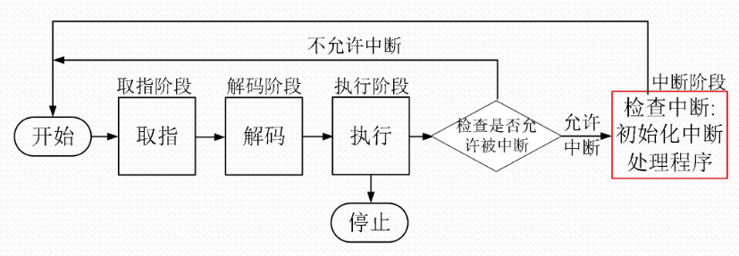
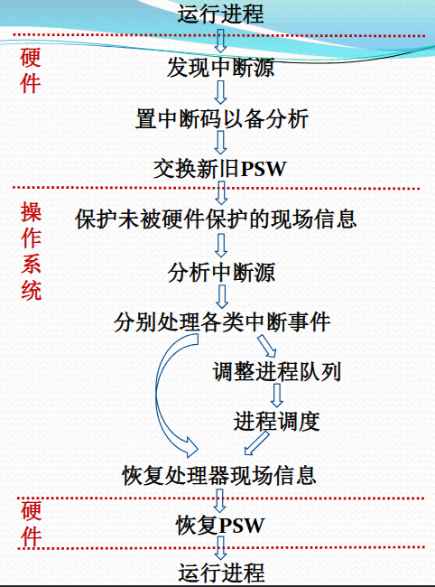
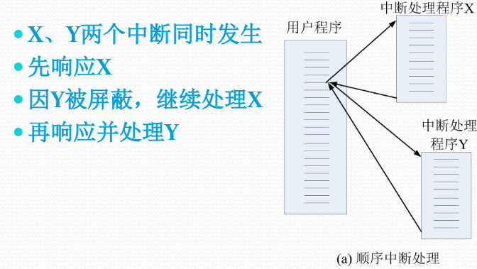
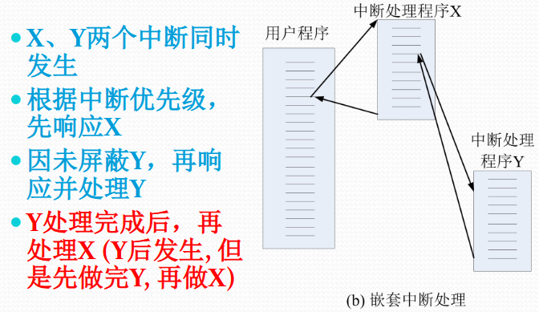

# 中断

#### 1. 基本概念

##### 广义的中断

中断（广义）：程序执行过程中，遇到急需处理事件时，暂时中止CPU上现行程序的运行，转去执行相应的事件处理程序，待处理完成后再返回原程序被中断处或调度其他程序执行的过程

##### 中断、异常、系统调用

- **系统调用**：指执行陷入指令而触发系统调用引起的中断事件(应用程序主动向操作系统发出服务请求)
  - 源头：应用程序请求操作提供服务

  - 处理时间：异步或同步（比如：同步：read()会阻塞，读完数据才继续跑代码，异步：aio_read()操作系统会记录这个请求，然后控制权就立刻回到应用程序了）
- **异常**：非法指令或其他坏的处理状态（比如：除0、内存出错）
  - 源头：应用程序的意外行为

  - 处理时间：同步（同步：指代码按顺序执行。当一个任务（调用者）发起一个操作（如读取文件）时，它必须一直等待该操作完成并返回结果后，才能继续执行下一行代码）
- **中断**：来自不同硬件设备的计时器和网络的中断
  - 源头：外设
  - 处理时间：异步（异步：指代码并发执行。当一个任务发起一个操作后，它不需要等待该操作完成，而是立刻返回去执行接下来的代码。当那个被调用的操作最终完成后，系统会通过状态、通知或回调函数来告诉调用者。）

##### PSW

包括：程序计数器、指令寄存器、条件码、中断字、中断允许/禁止、中断屏蔽、处理器模式、内存保护、调试控制

#### 2. 中断源

- 处理器硬件故障中断事件：由处理器、内存储器、总线等硬件故障引起的中断事件
- 程序性中断事件：除0、非法指令、地址越界、虚拟地址异常等等
- 自愿性中断事件：处理器执行陷入指令请求OS服务引起的中断事件：系统调用
- I/O中断事件：来源于外围设备，用于报告I/O状态的中断事件
- 外部中断事件：由外围设备发出的信号引起的中断事件，键盘/鼠标信号、时钟/间隔时钟中断等等

#### 3. 中断系统

##### 中断子系统

中断系统 = 硬件子系统 + 软件子系统

- 中断**响应**由硬件子系统完成
- 中断**处理**由软件子系统完成

##### 中断响应处理与指令执行周期*

##### 中断装置

中断装置：发现并响应中断/异常的**硬件**装置

- 由于中断源的多样性，硬件实现的中断装置有多种，分别处理不同类型的中断（处理器外的中断、处理器内的异常、请求OS服务的系统异常）

##### 中断控制器

中断控制器：CPU中的一个控制部件，包括中断控制逻辑线路和中断寄存器

- 外部设备向其发出中断请求IRQ，在中断寄存器中设置已发生的中断
- 指令处理结束前，会检查中断寄存器，若有不被屏蔽的中断产生，则改变处理器内操作的顺序，引出操作系统中的中断处理程序 (查询中断向量表)
- 中断向量表IVT包含中断服务程序地址的特定内存区域，这些服务程序是处理中断请求的代码

##### 中断响应过程*

中断响应由硬件子系统完成

1. 外设发信号，中断控制器“汇总上报”
2. CPU 在 指令周期的末尾 感知信号
   - CPU 不是任何时候都会响应中断，CPU 内部有一个循环：**取指 -> 译码 -> 执行 -> 检查中断**
3. 关中断与保存现场
   - 这里只是把 PSW/PC 保存到核心栈
4. 获取中断向量，查表找地址
   - cpu 先得到中断号，然后去中断向量表（IVT）中找到对应的中断向量（中断代码的起始位置）
5. 转向操作系统的中断处理程序

##### 中断处理过程*

中断处理由软件子系统完成

1. 保护未被硬件保护的处理器状态
2. 通过分析被中断进程的PSW中断码字段，识别中断源
3. 分别处理发生的中断事件(查中断向量表，执行中断处理子程序)
4. 恢复正常操作
   - 对于某些中断，在处理完毕后，直接返回刚刚被中断的进程
   - 还有一些需要中断当前进程的运行，调整进程队列，启动进程调度(处理器低级调度)，选择下一个执行的进程并恢复其执行

##### 响应 + 处理

#### 4. 多中断的响应与处理

##### 中断屏蔽

当计算机检测到中断时，[中断装置](#中断装置)通过中断屏蔽位决定是否响应已发生的中断

##### 中断优先级

中断优先级会决定当计算机同时检测到多个中断时, 中断装置**响应**中断的顺序

##### 中断的嵌套处理

- 当计算机响应中断后，在中断处理过程中，可以再响应其他中断

- **中断的嵌套处理可能改变中断处理次序，先响应的有可能后处理**
- 操作系统是性能攸关程序系统，且中断响应处理有硬件要求，考虑系统效率和实现代价问题，中断的嵌套处理应限制在一定层数内，如3层

- 例：

