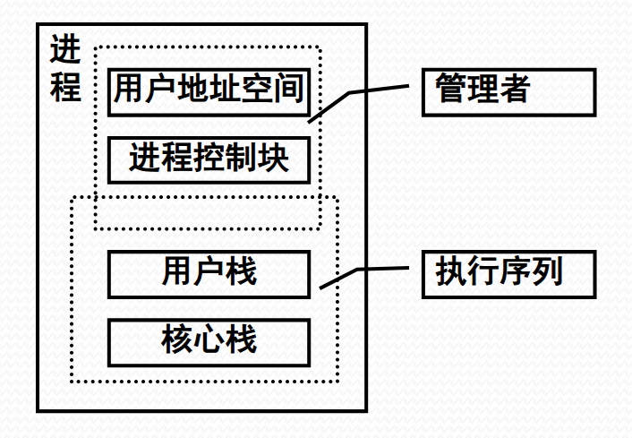
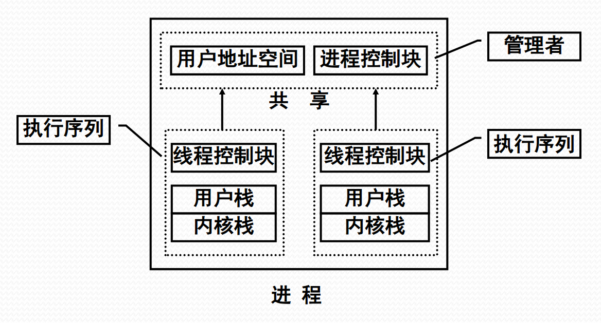
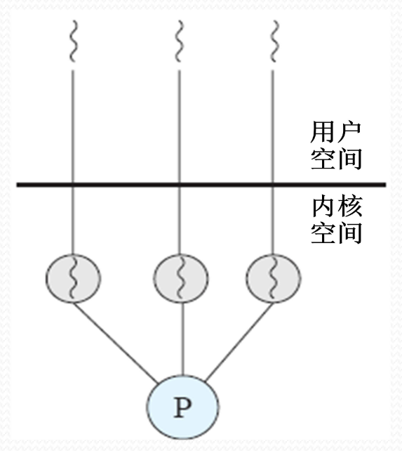
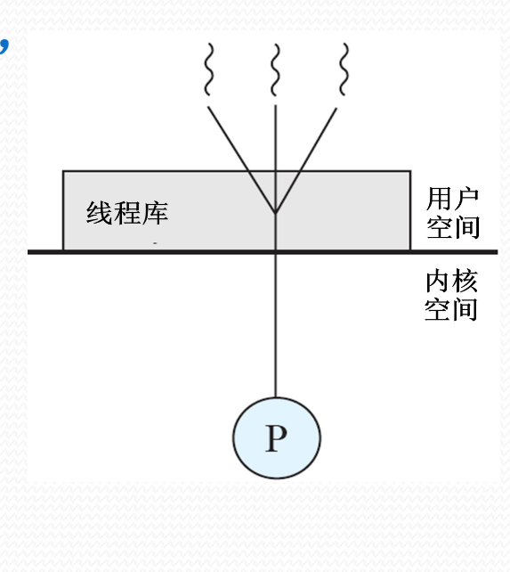

# 多线程

#### 1. 多线程环境概述

##### 多线程环境概述

- 单线程结构进程
  
  - 问题：进程切换开销大、 进程通信开销大、限制了进程并发的粒度、降低了并行计算的效率

- 多线程结构进程
  

- 在多线程环境下：
  - 进程是操作系统中进行保护和资源分配的独立单位
  -  线程是进程的一条执行路径，是调度的基本单位（处理器调度最终落在线程一级）
  - 线程调度：
    - 线程状态有运行、就绪和睡眠，无挂起
    - OS感知线程环境下：
      - 处理器调度对象是线程
      - 进程没有三状态（或者说只有挂起状态）
    - OS不感知线程环境下：
      - 处理器调度对象仍是进程
      - 用户空间中的用户调度程序调度线程

##### KLT 和 ULT

- 内核级线程 KLT, Kernel-Level Threads
  
  - 线程管理的所有工作由OS内核来做
  - OS提供了一个应用程序设计接口API，供开发者使用KLT
  - OS直接调度KLT

- 用户级线程 ULT, User-Level Threads
  
  - 用户空间运行的线程库，提供多线程应用程序的开发和运行支撑环境
  - 任何应用程序均需通过线程库进行程序设计，再与线程库连接后运行
  - 线程管理的所有工作都由应用程序完成，内核没有意识到线程的存在 

- Jacketing技术
  - 用于解决用户级线程在执行阻塞式系统调用时，导致整个进程被挂起的问题
  - 把阻塞式系统调用改造成非阻塞式的
  - 当线程陷入系统调用时，执行jacketing程序
  - 由jacketing 程序来检查资源使用情况，以决定是否执行进程切换或传递控制权给另一个线程

##### 多线程实现的混合策略

P110