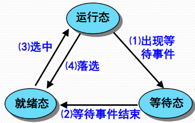
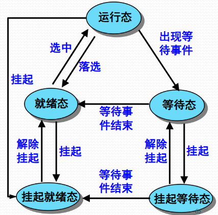
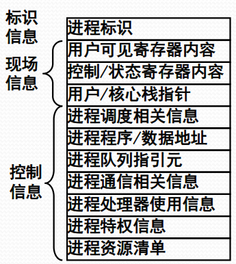
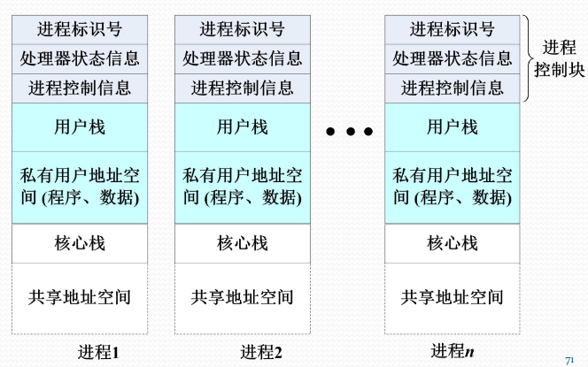

# 进程

#### 1. 基本概念

##### 进程的概念

- 进程是一个具有一定独立功能的程序关于某个数据集合的一次运行活动
- 进程是操作系统进行资源分配和处理器调度的一个独立单位

- 形式化定义：

  一个进程包括5个部分

  1. OS管理运行程序的数据结构
  2. 运行程序的内存代码
  3. 运行程序的内存数据
  4. 运行程序的通用寄存器信息
  5. PSW

##### 可再入程序

共享的代码称为**可再入程序**，如编辑器。可再入程序是**纯代码**的

- “可再入程序”：在操作系统中，如果一个程序在执行期间被中断，然后另一个任务（或进程/线程）又调用了同一个程序，当第一个任务恢复执行时，程序仍然能够产生完全正确的结果，这个程序就叫“可再入程序”。
- “纯代码”：纯代码指的是绝对不改变自身内容的代码（只读代码）。它里面只有逻辑指令（比如“做加法”、“把东西存入寄存器”），不包含任何会被修改的局部数据或状态。

##### 进程的三态模型*

- **运行态**指进程占有处理器运行
- **就绪态**指进程具备运行条件等待处理器运行
- **等待态**指进程由于等待资源、输入输出、信号等不具备运行条件（等待态(Waiting)=阻塞态(Blocked））

##### 进程挂起*

- 为什么需要进程挂起？
  - 原因：OS无法预期进程的数目与资源需求，计算机系统在运行过程中可能出现资源不足的情况
    - 运行资源不足表现为**性能低**和**死锁**两种情况（死锁的形式化定义：“如果在系统 $T$ 中，状态 $s$ 是‘可达的’（reachable）并且是‘终止的’（terminal），那么状态 $s$ 就是系统 $T$ 的一个死锁状态。”）
  - 解决方案：剥夺某些进程的内存及其他资源，调入OS管理的对换区，不参加进程调度，待适当时候再调入内存、恢复资源、参与运行

- 挂起态和等待态的区别：后者占有已申请到的资源处于等待，前者没有任何资源
- **进程挂起的选择与恢复**
  

#### 2. 进程的数据描述

##### 进程控制块 PCB

进程控制块PCB是OS用于记录和刻画进程状态及环境信息的数据结构

- 标识信息
- 现场信息
  1. 用户可见寄存器内容：数据寄存器、地址寄存器
  2. 控制与状态寄存器内容：PC、IR、PSW
  3. 栈指针内容：核心栈和用户栈指针

- 控制信息

##### 进程映像

某一时刻进程的内容及其执行状态集合：

1. 进程控制块（PCB）：保存进程的标识信息、状态信息和控制信息
2. 进程程序块: 进程执行的程序空间
3. 进程数据块: 进程处理的数据空间，包括数据、处理函数的用户栈和可修改的程序
4. 核心栈: 进程在内核模式下运行时使用的堆栈，中断或系统调用使用

##### 进程上下文

OS中的进程物理实体和支持进程运行的环境合成进程上下文，包括以下：

- 用户级上下文：用户程序块/用户数据区/用户栈/用户共享内存
- 寄存器上下文：PSW/栈指针/通用寄存器
- 系统级上下文：PCB/内存区表/核心栈

#### 3. 进程管理的实现

P76