## 0. 基本概念

- realizable path：一条 return 和 call 想对应的路径
  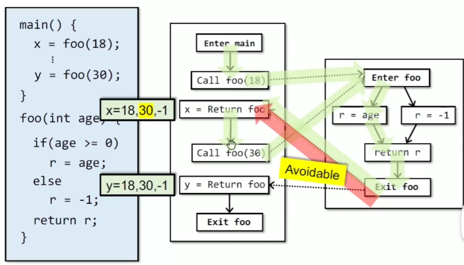


## 1. CFL-Reachability

用 CFL 来**判定 realizable path**

1. 首先先规定：
   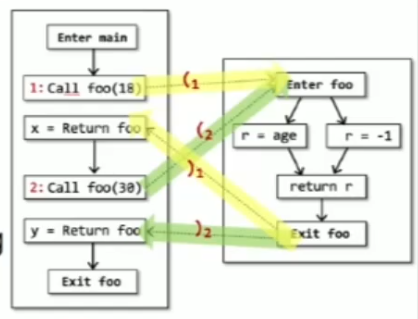

   *   每个右括号 $)_i$ 都必须由其前面的一个左括号 $(_i$ 与之匹配（平衡），但反过来则不必严格成立（即：可以有左括号，但没有对应的右括号）。

   *   对于每一个调用点（call site）$i$，将其“调用边（call edge）”标记为左括号 $(_i$，将其“返回边（return edge）”标记为右括号 $)_i$。

   *   将其余所有的边标记为符号 $e$（代表内部边或空字符）。

2. 可以写出 CFL：
   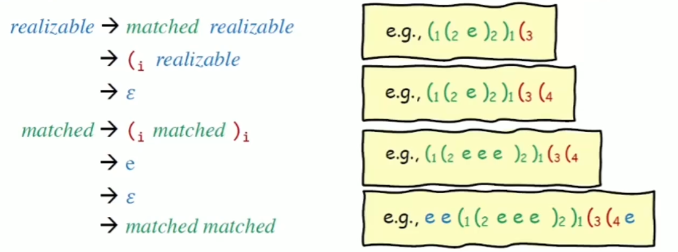

3. 然后基于这个 CFL 可以给出定义：**如果一条路径对应的字符串属于这个 CFL ，那这个路径就是 realizable path**

## 2. IFDS（Interprocedural, Finite, Distributive, Subset)

把程序分析问题转换为图可达性问题，而不像之前数据流分析中的传播

- IFDS 就是处理满足 Interprocedural, Finite, Distributive, Subset 的问题的
  - Interprocedural：过程间的，没啥好说的
  - Finite：domain 是有限的（？？？）
  - Distributive：
    - gen 和 kill 都是 Distributive 的
  - Subset：

- IFDS 会得到一个 MRP 解
  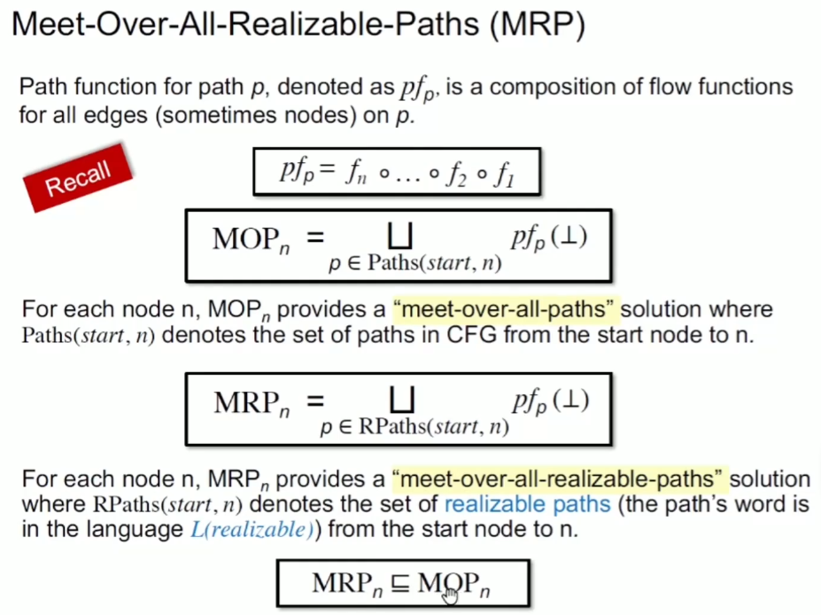

### **IFDS 的处理流程**

  对于程序 $P$ 和数据流问题 $Q$
  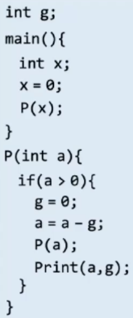

#### 1. 建立 supergraph $G^* = (N^*, E^*)$

  - $G^*$ 是由每一个方法的 graph 组成的；
  - 每一个方法的 graph 都有唯一的一个 start node 和 一个 exit node；
  - 每一次 Call 都用 Call 节点和 Ret 节点构成
    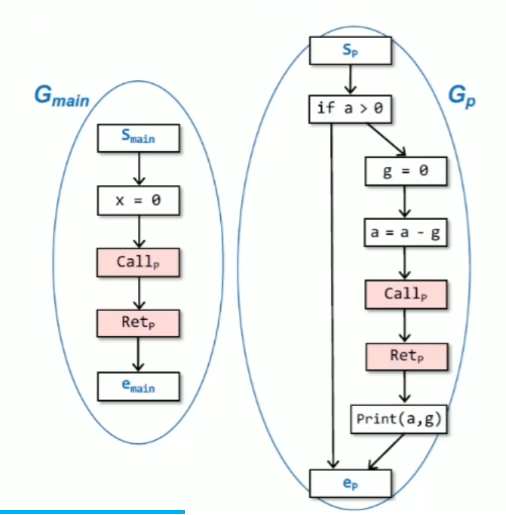
    
    - 比如这里的 $G_{main}$ 和 $G_p$ 就构成了 $G^*$
    
  - 对于 Call $G^*$ 有三种类型的边
    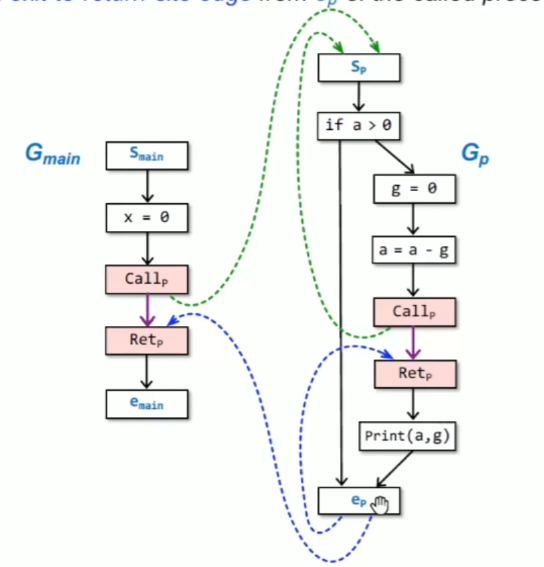
    
    a.  *call-to-return-site edge*：从 Call<sub>P</sub> 指向 Ret<sub>p</sub> 的边（上图中的紫色的边）
    
    b. *call-to-start edge*：从 Call<sub>p</sub> 指向 S<sub>p</sub> 的边（上图中绿色的边）
    
    c. *exit-to-return-site edge*：从 e<sub>p</sub> 指向 Ret<sub>p</sub> 的边

#### 2. 在 supergraph $G^*$ 上设计 Flow Functions

  以 "Possibly-uninitialized variables" （对于每一个节点之前可能未初始化变量的集合）为例，通过 $\lambda$ 函数来表示

  - 建立好的 $G^*$ 如下：
    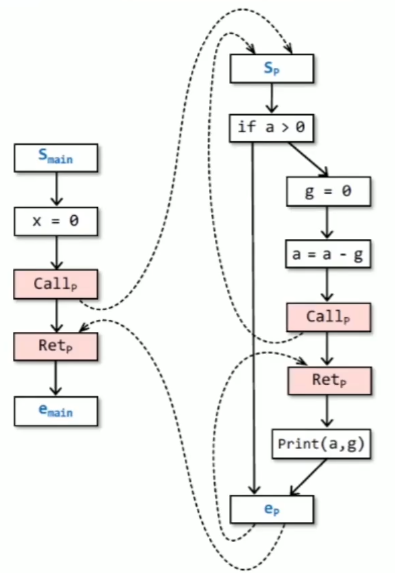
  - 在 $G^*$ 上的每一条边上传建 Flow Function
    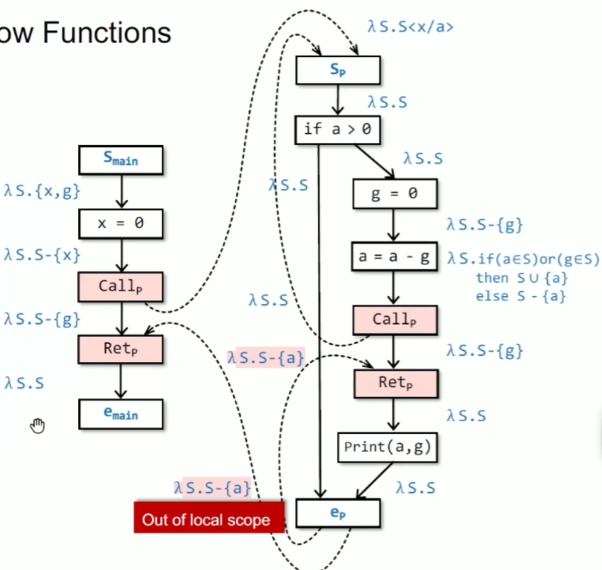

#### 3. 建立 exploded supergraph $G^\#$ 

  - 把 Flow Functions 转换为 representation relations
  
    - 每一个 flow function 可以被表示成一个有 $2 * (D+1)$ 个节点的图（其中 $D$ 是一个有限的数据流事实集合，一个有限的数据流事实集合在活跃变量分析中就是所有变量，在可用表达式分析中就是所有表达式）
    
    - 具体的转换逻辑：
      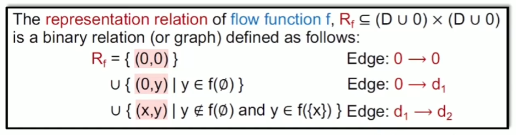
      
      > **这里补充一些我的理解：**
      >
      > - 在传统的数据流分析中，数据流事实是被打包成**集合**来处理的
      >
      >   -  比如，在语句 `s` 之前，有一堆事实集合 $IN$，经过语句 `s` 的流函数 $f$ 处理后，变成新的集合 $OUT$：
      >      $$OUT = f(IN) = (IN - KILL) \cup GEN$$
      >   -  **痛点：** 如果只是分析单个函数体，用集合算一算（求并集、交集）还挺快。但如果是**跨函数分析（Interprocedural）**，函数调用千丝万缕，如果还用集合不断地代入计算，计算复杂度和状态空间会呈指数级爆炸，算不出来。
      >
      > - 那 IFDS 是咋解决的呢？IFDS 发现许多常见的数据流分析（如未初始化变量、污点分析、到达定值等）满足**分配律**（分配率就是：$$f( \{a, b, c\} ) = f(\{a\}) \cup f(\{b\}) \cup f(\{c\})$$）
      >
      >   -  所以我们根本不需要把$\{a, b, c\}$作为一个整体集合去计算，我们可以把集合拆散，让流函数 $f$ 依次只处理单个事实 $a、b、c$
      >
      >   -  所以上面的 $R_f$ 才可以**独立地**考虑每一个**单独**的变量
      >
      > - 那如果可以独立地考虑每一个变量，又怎么把原本的数据流传递转换成图可达性呢？
      >
      >   1. $R_f = \{ (0,0) \}$ ：不管经过什么代码，由于程序还需要继续执行，未来可能还会用到 0 节点去生成别的事实，所以 0 节点必须永远存活并传递给下一行代码
      >
      >   2. $\cup \{ (0, y) \mid y \in f(\emptyset) \}$ ：这里表示即使输入是一个空集，仍然产生了数据流事实 y。其实这里就像传统数据流分析中的 $GEN$
      >   3. $\cup \{ (x, y) \mid y \notin f(\emptyset) \text{ and } y \in f(\{x\}) \}$ ：就是数据流事实的**传递**和**转换**
      >      - 前半句 $y \notin f(\emptyset)$ 是为了去重，防止和第2条规则画重复的边。
      >      -   *代码例子 1（传递）：* 语句是 `b = 2;`，输入事实有 $d_1$: “a 被定值”。因为 `b=2` 不影响 `a`，所以事实 $d_1$ 原样活下来了。画边：$d_1 \rightarrow d_1$。
      >      -   *代码例子 2（转换）：* 语句是 `c = a;` （我们在做污点分析），输入事实有 $d_1$: “a 是脏数据”。流函数分析发现，脏数据 a 赋给了 c，所以 c 也脏了（变成了事实 $d_2$）。画边：$d_1 \rightarrow d_2$。
      > - 经过原本的数据流转换到图可达性，以前的语义放到转变后应该怎么描述呢？
      >   - 以前是检查某个数据流事实是否在某个 $OUT$ 中，现在是看从 \<S<sub>mian</sub>, 0\> 到 \<对应节点，你要查看的数据流事实\> 是否有一条 Path
      
      实际举例：
      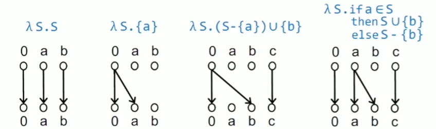
  
  - 那通过这种方式 我们把上面的 $G^*$ 转换为 $G^\#$ 
  
    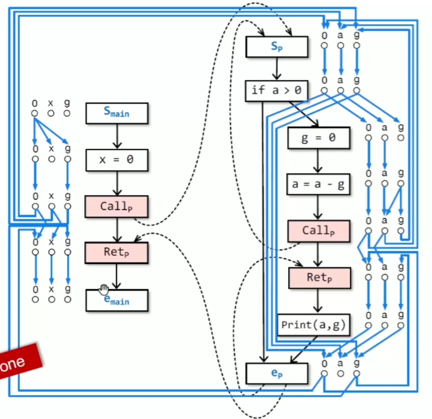
  
    举个例子：
    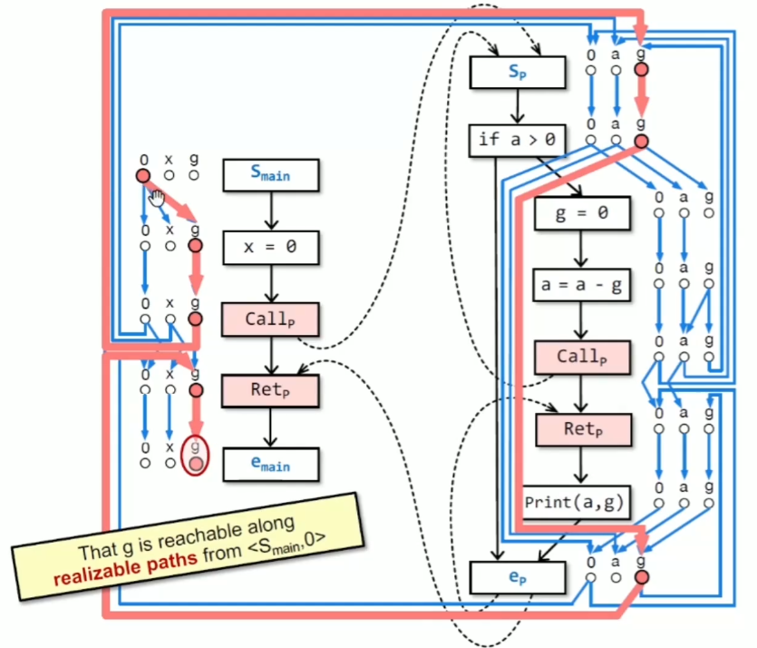
  
    - 比如这里从 \<S<sub>mian</sub>, 0\> 能找到一个 **realizable path** 走到图上的 g 点，就说明在图上的那个终点块的位置 g 可能没被初始化
  
  - > 补充：我们一直说的 *转换成图可达问题* ，实际上是要搞 realizable path reachability

#### 4. 现在有 $G^\#$ 了，接下来要找 realizable path

  - 使用 **Tabulation Algorithm** 找出所有从 $\langle s_{main}, 0 \rangle$ 出发的 realizable paths ，来确定 MRP 解
    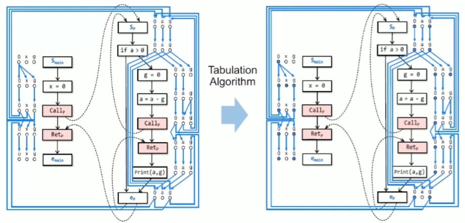
    其中标蓝点的就是 $\langle s_{main}, 0 \rangle$ 出发的 realizable paths 可到的点

####  5. **Tabulation Algorithm** 

  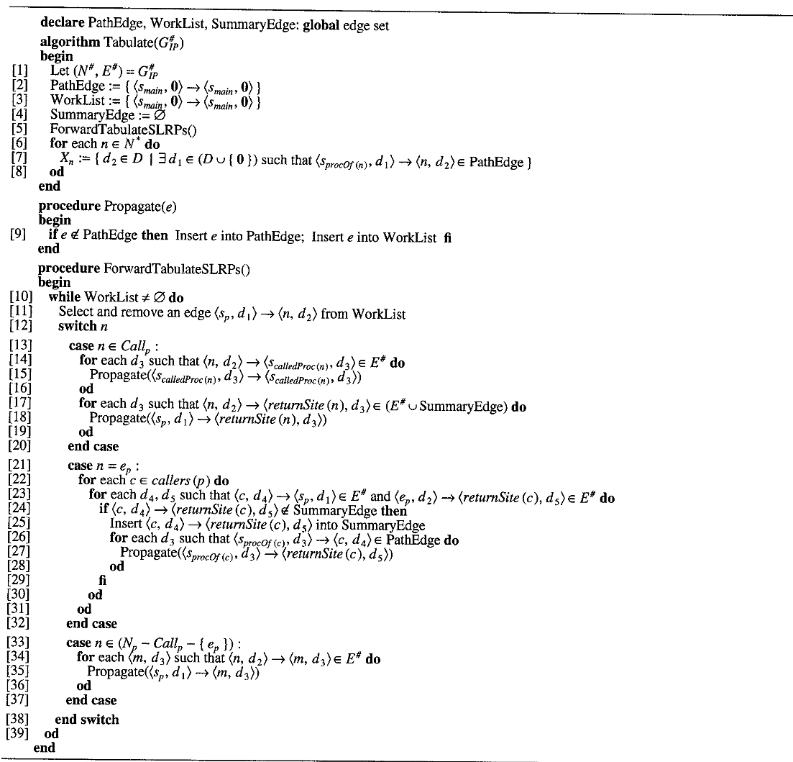

  - ###### 先看 1-8 行：算法的整体结构
  
    - 首先先看算法的整体的数据结构：三个全局**集合**：
      1. **`PathEdge`**：记录了从函数入口点 `s_p`（处于某种状态 `d1`）出发，经过一系列 realizable path 到达当前节点 `n`（处于状态 `d2`）的路径存在性。
         - 表示为：$\langle s_p, d_1 \rangle \to \langle n, d_2 \rangle$
         - **直观理解**：如果这个边在集合里，说明存在一条合法的路径，使得函数在入口处为 $d_1$ 时，执行到节点 $n$ 时状态变为 $d_2$。
      2. **`WorkList`**: 工作队列。它存放的是待处理的 `PathEdge`。算法不断从这里取出边，看看它是否能“延伸”到邻接节点。
      3. **`SummaryEdge`**：这是算法的灵魂。它记录了函数调用关系的摘要。
         - 表示为：$\langle c, d_4 \rangle \to \langle \text{returnSite}(c), d_5 \rangle$
         - **直观理解**：如果调用点 $c$ 处状态为 $d_4$，那么调用结束后，返回点处状态必为 $d_5$。
         - **作用**：当你再次遇到同样的函数调用（且输入状态相同）时，不需要重新进入函数内部计算，直接读取这个摘要边即可。
    - 2-4 行：初始化
      - `PathEdge := { ⟨s_main, 0⟩ → ⟨s_main, 0⟩ }`
      - `WorkList := { ⟨s_main, 0⟩ → ⟨s_main, 0⟩ }`
      - `SummaryEdge` 初始化为空集
    - 5 行：执行主函数
    - 6-8 行：
      - **`for each n ∈ N* do`**：遍历程序中 Exploded Supergraph 的每一个节点 $n$
      - **`X_n := { d2 ∈ D | ... }`**：从路径集合到节点属性的映射
        - $S_{procOf(n)}$ 是什么？是节点 $n$ 所在函数的入口节点
        - 所以这一行的含义就是：只要存在**任何**一种可能的程序入口状态（$d_1$），使得程序能从该函数的入口点出发，沿着合法的路径到达 $n$，并且在 $n$ 处的状态为 $d_2$，那么 $d_2$ 就是 $n$ 点合法的分析结果、
  
  - ###### 接下来看 `Propagate` 函数
    
    ```code
    procedure Propagate(e)
    begin
    [9] if e ∉ PathEdge then 
            Insert e into PathEdge; 
            Insert e into WorkList 
        fi
    end
    ```
    
    挺好理解
    
  - ###### 最后看最吊的 `ForwardTabulateSLRPs` 函数
  
    - 整体就是一个 workList 算法
    
    - 可以先看运行完这个函数之后 `PathEdge` 中是什么内容
    
      1. 内部跳转边：`⟨s_p, d_1⟩ → ⟨n, d_2⟩`
         - s_p 是函数 p 的入口节点，n 是函数 p 内的节点
      2. 函数调用边（Call-to-Entry Edges）：`⟨s_q, d_3⟩ → ⟨s_q, d_3⟩`
         - 这是一个“启动信号”。它意味着在函数 $q$ 的入口处，已经有一个合法的状态 $d_3$ 被激活了（这是由某个调用点 $n$ 传递进来的）
      3. 过程间摘要边 (Interprocedural Summary Edges)：`⟨s_p, d_1⟩ → ⟨returnSite(n), d_3⟩`
         - 含义就是如果在函数 $p$ 的入口处状态是 $d_1$，那么经过调用点 $n$（调用函数 $q$），回到 `returnSite(n)` 时，状态变为了 $d_3$
         - 这条边是有说法的，它把复杂的“进入函数->计算->返回”过程，压缩成了一条主函数内部的直接跳转边
    
    - 13-20 行
    
      ```code
      [13] case n ∈ Call_p :
      [14]   for each d3 such that ⟨n, d2⟩ → ⟨calledProc(n), d3⟩ ∈ E# do
      [15]     Propagate(⟨calledProc(n), d3⟩ → ⟨calledProc(n), d3⟩)
      [16]   od
      [17]   for each d3 such that ⟨n, d2⟩ → ⟨returnSite(n), d3⟩ ∈ E# do
      [18]     Propagate(⟨s_p, d1⟩ → ⟨returnSite(n), d3⟩)
      [19]   od
      [20] end case
      ```
    
      - `Call_p` 是什么？ 就是程序中所有 Call Sites 的集合
      - `calledProc(n)` 是什么？ 获取调用点 $n$ 调用的目标函数的入口节点
        - 输入：一个节点。并且这个节点是掉用点
        - 输出：被调用的函数的入口节点
      - `returnSite(n)` 是什么？ 当函数调用点 $n$ 执行完毕后，程序执行流应该回到的下一条指令的节点
      - `s_p` 是什么？ 是当前在分析的调用者函数（Caller）的入口节点
      - 14-16 行：
        - 逻辑：我要调用 `calledProc(n)` 了，我得通知那个函数：“有人来调用你了，请从状态 `calledProc(n)` 开始你的分析”
        - 作用：这会触发算法去把这个 $d_3$ 沿着被调函数内部的所有路径跑一遍。这相当于给被调函数“注入”了一个新的初始条件
      - 17-19 行：
        - 作用就是加上从函数入口（比如 `main` 函数的入口）到 `returnSite(n)` 的一条 Path
    
    - 21-32 行
    
      ```code
      [21] case n = ep :
      [22]   for each c ∈ callers(p) do
      [23]     for each d4, d5 such that ⟨c, d4⟩ → ⟨sp, d1⟩ ∈ E# and ⟨ep, d2⟩ → ⟨returnSite(c), d5⟩ ∈ E# do
      [24]       if ⟨c, d4⟩ → ⟨returnSite(c), d5⟩ ∉ SummaryEdge then
      [25]         Insert ⟨c, d4⟩ → ⟨returnSite(c), d5⟩ into SummaryEdge
      [26]         for each d3 such that ⟨sprocOf(c), d3⟩ → ⟨c, d4⟩ ∈ PathEdge do
      [27]           Propagate(⟨sprocOf(c), d3⟩ → ⟨returnSite(c), d5⟩)
      [28]         od
      [29]       fi
      [30]     od
      [31]   od
      [32] end case
      ```
    
      - `e_p` 是什么？是当前在分析的调用者函数（Caller）的出口节点
      - `callers(p)` 是什么？查询调用了函数 $p$ 的所有调用点
        - 输入：函数 $p$
        - 输出：一个集合，其中包含了所有调用函数 $p$ 的 Call Sites
      - 23行：循环查找所有可能的调用点，它在检查：
        - 调用点 $c$ 处的状态 $d_4$ 是否能传给 $s_p$ 的状态 $d_1$？
        - 函数出口 $e_p$ 的状态 $d_2$ 是否能传回返回点 `returnSite(c)` 的状态 $d_5$？
        - 如果上面两条规则成立，就找到了一条合法的 call-return 路径
      - 24-25 行：更新 SummaryEdge
        - 如果这是我们第一次发现 `c` 到 `returnSite(c)` 的路径，我们就把它存入 `SummaryEdge`
        - 从此以后，当算法再次路过调用点 $c$ 时，它就不需要再执行 13-16 行的操作了，直接查这个 `SummaryEdge` 就能得到结果
      - 26-27行：
        - 遍历当前调用者函数（`sprocOf(c)`，比如 `main` 函数的入口节点）中所有能到达调用点 $c$ 的路径
        - 它把这些路径全部“补全”：从入口处 $d_3$ 出发，经过调用，最后到达返回点 $d_5$
        - Propagate 的意义：这触发了调用者函数后续的逻辑继续运行
      - 21-32行能够确保函数p被A、B调用，p 返回给 A 的结果是基于 A 的输入，返回给 B 的结果是基于 B 的输入
    
    - 33-37 行
    
      ```code
      [33] case n ∈ (Np - Callp - { ep }) :
      [34]   for each ⟨m, d3⟩ such that ⟨n, d2⟩ → ⟨m, d3⟩ ∈ E# do
      [35]     Propagate(⟨sp, d1⟩ → ⟨m, d3⟩)
      [36]   od
      [37] end case
      ```
    
      就是传播普通的指令
    
    - 最后看完好像也没有那么 nb，主要是前面的思想

## 3. IFDS实现

```typescript
type CallToReturnCacheEdge<D> = PathEdge<D>;

export abstract class DataflowSolver<D> {
    protected problem: DataflowProblem<D>;
    protected workList: Array<PathEdge<D>>;
    protected pathEdgeSet: Set<PathEdge<D>>;
    protected zeroFact: D;
    protected inComing: Map<PathEdgePoint<D>, Set<PathEdgePoint<D>>>;
    protected endSummary: Map<PathEdgePoint<D>, Set<PathEdgePoint<D>>>;
    protected summaryEdge: Set<CallToReturnCacheEdge<D>>; // summaryEdge不是加速一个函数内多次调用同一个函数，而是加速多次调用同一个函数f时，f内的函数调用
    protected scene: Scene;
    protected CHA!: ClassHierarchyAnalysis;
    protected stmtNexts: Map<Stmt, Set<Stmt>>;
    protected laterEdges: Set<PathEdge<D>> = new Set();

    constructor(problem: DataflowProblem<D>, scene: Scene) {
        this.problem = problem;
        this.scene = scene;
        scene.inferTypes();
        this.zeroFact = problem.createZeroValue();
        this.workList = new Array<PathEdge<D>>();
        this.pathEdgeSet = new Set<PathEdge<D>>();
        this.inComing = new Map<PathEdgePoint<D>, Set<PathEdgePoint<D>>>();
        this.endSummary = new Map<PathEdgePoint<D>, Set<PathEdgePoint<D>>>();
        this.summaryEdge = new Set<CallToReturnCacheEdge<D>>();
        this.stmtNexts = new Map();
    }

    public solve(): void {
        this.init();
        this.doSolve();
    }

    protected computeResult(stmt: Stmt, d: D): boolean {
        for (let pathEdge of this.pathEdgeSet) {
            if (pathEdge.edgeEnd.node === stmt && pathEdge.edgeEnd.fact === d) {
                return true;
            }
        }
        return false;
    }

    protected getChildren(stmt: Stmt): Stmt[] {
        return Array.from(this.stmtNexts.get(stmt) || []);
    }

    protected init(): void {
        let edgePoint: PathEdgePoint<D> = new PathEdgePoint<D>(this.problem.getEntryPoint(), this.zeroFact);
        let edge: PathEdge<D> = new PathEdge<D>(edgePoint, edgePoint);
        this.workList.push(edge);
        this.pathEdgeSet.add(edge);

        // build CHA
        let cg = new CallGraph(this.scene);
        this.CHA = new ClassHierarchyAnalysis(this.scene, cg, new CallGraphBuilder(cg, this.scene));
        this.buildStmtMapInClass();
        this.setCfg4AllStmt();
        return;
    }

    protected buildStmtMapInClass(): void {
        const methods = this.scene.getMethods();
        methods.push(this.problem.getEntryMethod());
        for (const method of methods) {
            const cfg = method.getCfg();
            const blocks: BasicBlock[] = [];
            if (cfg) {
                blocks.push(...cfg.getBlocks());
            }
            for (const block of blocks) {
                this.buildStmtMapInBlock(block);
            }
        }
    }

    protected buildStmtMapInBlock(block: BasicBlock): void {
        const stmts = block.getStmts();
        for (let stmtIndex = 0; stmtIndex < stmts.length; stmtIndex++) {
            const stmt = stmts[stmtIndex];
            if (stmtIndex !== stmts.length - 1) {
                this.stmtNexts.set(stmt, new Set([stmts[stmtIndex + 1]]));
            } else {
                const set: Set<Stmt> = new Set();
                for (const successor of block.getSuccessors()) {
                    set.add(successor.getHead()!);
                }
                this.stmtNexts.set(stmt, set);
            }
        }
    }

    protected setCfg4AllStmt(): void {
        for (const cls of this.scene.getClasses()) {
            for (const mtd of cls.getMethods(true)) {
                addCfg2Stmt(mtd);
            }
        }
    }

    protected getAllCalleeMethods(callNode: ArkInvokeStmt): Set<ArkMethod> {
        const callSites = this.CHA.resolveCall(
            this.CHA.getCallGraph().getCallGraphNodeByMethod(this.problem.getEntryMethod().getSignature()).getID(),
            callNode
        );
        const methods: Set<ArkMethod> = new Set();
        for (const callSite of callSites) {
            const method = this.scene.getMethod(this.CHA.getCallGraph().getMethodByFuncID(callSite.calleeFuncID)!);
            if (method) {
                methods.add(method);
            }
        }
        return methods;
    }

    protected getReturnSiteOfCall(call: Stmt): Stmt {
        return [...this.stmtNexts.get(call)!][0];
    }

    protected getStartOfCallerMethod(call: Stmt): Stmt {
        const cfg = call.getCfg()!;
        const paraNum = cfg.getDeclaringMethod().getParameters().length;
        return cfg.getStartingBlock()!.getStmts()[paraNum];
    }

    protected pathEdgeSetHasEdge(edge: PathEdge<D>): boolean {
        for (const path of this.pathEdgeSet) {
            this.problem.factEqual(path.edgeEnd.fact, edge.edgeEnd.fact);
            if (
                path.edgeEnd.node === edge.edgeEnd.node &&
                this.problem.factEqual(path.edgeEnd.fact, edge.edgeEnd.fact) &&
                path.edgeStart.node === edge.edgeStart.node &&
                this.problem.factEqual(path.edgeStart.fact, edge.edgeStart.fact)
            ) {
                return true;
            }
        }
        return false;
    }

    protected propagate(edge: PathEdge<D>): void {
        if (!this.pathEdgeSetHasEdge(edge)) {
            let index = this.workList.length;
            for (let i = 0; i < this.workList.length; i++) {
                if (this.laterEdges.has(this.workList[i])) {
                    index = i;
                    break;
                }
            }
            this.workList.splice(index, 0, edge);
            this.pathEdgeSet.add(edge);
        }
    }

    protected processExitNode(edge: PathEdge<D>): void {
        let startEdgePoint: PathEdgePoint<D> = edge.edgeStart;
        let exitEdgePoint: PathEdgePoint<D> = edge.edgeEnd;
        const summary = this.endSummary.get(startEdgePoint);
        if (summary === undefined) {
            this.endSummary.set(startEdgePoint, new Set([exitEdgePoint]));
        } else {
            summary.add(exitEdgePoint);
        }
        const callEdgePoints = this.inComing.get(startEdgePoint);
        if (callEdgePoints === undefined) {
            if (startEdgePoint.node.getCfg()!.getDeclaringMethod() === this.problem.getEntryMethod()) {
                return;
            }
            throw new Error('incoming does not have ' + startEdgePoint.node.getCfg()?.getDeclaringMethod().toString());
        }
        for (let callEdgePoint of callEdgePoints) {
            let returnSite: Stmt = this.getReturnSiteOfCall(callEdgePoint.node);
            let returnFlowFunc: FlowFunction<D> = this.problem.getExitToReturnFlowFunction(exitEdgePoint.node, returnSite, callEdgePoint.node);
            this.handleFacts(returnFlowFunc, returnSite, exitEdgePoint, callEdgePoint);
        }
    }

    private handleFacts(returnFlowFunc: FlowFunction<D>, returnSite: Stmt, exitEdgePoint: PathEdgePoint<D>, callEdgePoint: PathEdgePoint<D>): void {
        for (let fact of returnFlowFunc.getDataFacts(exitEdgePoint.fact)) {
            let returnSitePoint: PathEdgePoint<D> = new PathEdgePoint<D>(returnSite, fact);
            let cacheEdge: CallToReturnCacheEdge<D> = new PathEdge<D>(callEdgePoint, returnSitePoint);
            let summaryEdgeHasCacheEdge = false;
            for (const sEdge of this.summaryEdge) {
                if (sEdge.edgeStart === callEdgePoint && sEdge.edgeEnd.node === returnSite && sEdge.edgeEnd.fact === fact) {
                    summaryEdgeHasCacheEdge = true;
                    break;
                }
            }
            if (summaryEdgeHasCacheEdge) {
                continue;
            }
            this.summaryEdge.add(cacheEdge);
            let startOfCaller: Stmt = this.getStartOfCallerMethod(callEdgePoint.node);
            for (let pathEdge of this.pathEdgeSet) {
                if (pathEdge.edgeStart.node === startOfCaller && pathEdge.edgeEnd === callEdgePoint) {
                    this.propagate(new PathEdge<D>(pathEdge.edgeStart, returnSitePoint));
                }
            }
        }
    }

    protected processNormalNode(edge: PathEdge<D>): void {
        let start: PathEdgePoint<D> = edge.edgeStart;
        let end: PathEdgePoint<D> = edge.edgeEnd;
        let stmts: Stmt[] = [...this.getChildren(end.node)].reverse();
        for (let stmt of stmts) {
            let flowFunction: FlowFunction<D> = this.problem.getNormalFlowFunction(end.node, stmt);
            let set: Set<D> = flowFunction.getDataFacts(end.fact);
            for (let fact of set) {
                let edgePoint: PathEdgePoint<D> = new PathEdgePoint<D>(stmt, fact);
                const edge = new PathEdge<D>(start, edgePoint);
                this.propagate(edge);
                this.laterEdges.add(edge);
            }
        }
    }

    protected processCallNode(edge: PathEdge<D>): void {
        let start: PathEdgePoint<D> = edge.edgeStart;
        let callEdgePoint: PathEdgePoint<D> = edge.edgeEnd;
        const invokeStmt = callEdgePoint.node as ArkInvokeStmt;
        let callees: Set<ArkMethod>;
        if (this.scene.getFile(invokeStmt.getInvokeExpr().getMethodSignature().getDeclaringClassSignature().getDeclaringFileSignature())) {
            callees = this.getAllCalleeMethods(callEdgePoint.node as ArkInvokeStmt);
        } else {
            callees = new Set([getRecallMethodInParam(invokeStmt)!]);
        }
        let returnSite: Stmt = this.getReturnSiteOfCall(callEdgePoint.node);
        for (let callee of callees) {
            let callFlowFunc: FlowFunction<D> = this.problem.getCallFlowFunction(invokeStmt, callee);
            if (!callee.getCfg()) {
                continue;
            }
            let firstStmt: Stmt = callee.getCfg()!.getStartingBlock()!.getStmts()[callee.getParameters().length];
            let facts: Set<D> = callFlowFunc.getDataFacts(callEdgePoint.fact);
            for (let fact of facts) {
                this.callNodeFactPropagate(edge, firstStmt, fact, returnSite);
            }
        }
        let callToReturnflowFunc: FlowFunction<D> = this.problem.getCallToReturnFlowFunction(edge.edgeEnd.node, returnSite);
        let set: Set<D> = callToReturnflowFunc.getDataFacts(callEdgePoint.fact);
        for (let fact of set) {
            this.propagate(new PathEdge<D>(start, new PathEdgePoint<D>(returnSite, fact)));
        }
        for (let cacheEdge of this.summaryEdge) {
            if (cacheEdge.edgeStart === edge.edgeEnd && cacheEdge.edgeEnd.node === returnSite) {
                this.propagate(new PathEdge<D>(start, cacheEdge.edgeEnd));
            }
        }
    }

    protected callNodeFactPropagate(edge: PathEdge<D>, firstStmt: Stmt, fact: D, returnSite: Stmt): void {
        let callEdgePoint: PathEdgePoint<D> = edge.edgeEnd;
        // method start loop path edge
        let startEdgePoint: PathEdgePoint<D> = new PathEdgePoint(firstStmt, fact);
        this.propagate(new PathEdge<D>(startEdgePoint, startEdgePoint));
        //add callEdgePoint in inComing.get(startEdgePoint)
        let coming: Set<PathEdgePoint<D>> | undefined;
        for (const incoming of this.inComing.keys()) {
            if (incoming.fact === startEdgePoint.fact && incoming.node === startEdgePoint.node) {
                coming = this.inComing.get(incoming);
                break;
            }
        }
        if (coming === undefined) {
            this.inComing.set(startEdgePoint, new Set([callEdgePoint]));
        } else {
            coming.add(callEdgePoint);
        }
        let exitEdgePoints: Set<PathEdgePoint<D>> = new Set();
        for (const end of Array.from(this.endSummary.keys())) {
            if (end.fact === fact && end.node === firstStmt) {
                exitEdgePoints = this.endSummary.get(end)!;
            }
        }
        for (let exitEdgePoint of exitEdgePoints) {
            let returnFlowFunc = this.problem.getExitToReturnFlowFunction(exitEdgePoint.node, returnSite, callEdgePoint.node);
            for (let returnFact of returnFlowFunc.getDataFacts(exitEdgePoint.fact)) {
                this.summaryEdge.add(new PathEdge<D>(edge.edgeEnd, new PathEdgePoint<D>(returnSite, returnFact)));
            }
        }
    }

    protected doSolve(): void {
        while (this.workList.length !== 0) {
            let pathEdge: PathEdge<D> = this.workList.shift()!;
            if (this.laterEdges.has(pathEdge)) {
                this.laterEdges.delete(pathEdge);
            }
            let targetStmt: Stmt = pathEdge.edgeEnd.node;
            if (this.isCallStatement(targetStmt)) {
                this.processCallNode(pathEdge);
            } else if (this.isExitStatement(targetStmt)) {
                this.processExitNode(pathEdge);
            } else {
                this.processNormalNode(pathEdge);
            }
        }
    }

    protected isCallStatement(stmt: Stmt): boolean {
        for (const expr of stmt.getExprs()) {
            if (expr instanceof AbstractInvokeExpr) {
                if (this.scene.getFile(expr.getMethodSignature().getDeclaringClassSignature().getDeclaringFileSignature())) {
                    return true;
                }
                if (stmt instanceof ArkInvokeStmt && getRecallMethodInParam(stmt)) {
                    return true;
                }
            }
        }
        return false;
    }

    protected isExitStatement(stmt: Stmt): boolean {
        return stmt instanceof ArkReturnStmt || stmt instanceof ArkReturnVoidStmt;
    }

    public getPathEdgeSet(): Set<PathEdge<D>> {
        return this.pathEdgeSet;
    }
}

```

### 1. 先看类中的核心数据结构

- 和算法中相对应的数据结构：

  | 算法中的数据结构  | 代码中的实现                                 | 作用                                           |
  | :---------------- | :------------------------------------------- | :--------------------------------------------- |
  | **`PathEdge`**    | `pathEdgeSet: Set<PathEdge<D>>`              | 存储了所有已发现的 $⟨s_p, d_1⟩ \to ⟨n, d_2⟩$。 |
  | **`WorkList`**    | `workList: Array<PathEdge<D>>`               | 待处理的边队列，算法的发动机。                 |
  | **`SummaryEdge`** | `summaryEdge: Set<CallToReturnCacheEdge<D>>` | 缓存“函数调用摘要”，避免重复计算函数体。       |

- 引入的算法中没有的辅助数据结构，它们是为了支持**动态按需构建**：

  - `inComing: Map<PathEdgePoint<D>, Set<PathEdgePoint<D>>>`

    - key：被调用函数的入口状态（$⟨s_p, d_{in}⟩$）
    - value：一组 CallSites 的集合

  - `endSummary: Map<PathEdgePoint<D>, Set<PathEdgePoint<D>>>`

    - 存放了 **已完成的函数执行记录**，存储了从 `s_p` (入口) 出发，最终到达 `e_p` (出口) 的所有状态转换

    - 当一个新的调用点发现自己调用了函数 $p$ 时，它会先查 `endSummary`。如果 $p$ 之前已经分析过了，就直接把这里的记录拿去复用，无需重算整个函数

    - `endSummary` 和 `SummaryEdge` 有啥区别？

      | 特性         | `endSummary`                                      | `SummaryEdge`                                          |
      | :----------- | :------------------------------------------------ | :----------------------------------------------------- |
      | **关注点**   | 函数本身（从 $s_p$ 到 $e_p$）                     | 函数调用（从调用点 $c$ 到返回点 $ret$）                |
      | **存储内容** | “如果函数入口是 $d_{in}$，出口状态就是 $d_{out}$” | “如果调用点状态是 $d_4$，函数执行完后返回点就是 $d_5$” |
      | **生命周期** | 属于函数 $p$ 的私有记录                           | 属于调用点 $c$ 的上下文记录                            |
      | **目的**     | 避免函数体重复分析                                | 避免在调用点处重复进入函数体                           |
      
      - 为什么需要 `endSummary`：如果有多个地方调用了函数 $p$，且入口状态相同，算法会查看 `endSummary`，直接从记录中提取 $d_{out}$，而不需要重新跑一遍 `p` 的 CFG
      - 为什么需要 `SummaryEdge`：当算法运行到调用点 $c$ 时，它会优先查 `summaryEdge`。如果查到了，说明之前在调用点 $c$ 处已经算过这个函数了，直接把结果“传”到 `returnSite`，连“函数入口”都不用进

- 数据点的表示：`PathEdgePoint<D>`

  在伪代码中，我们简单地写 $⟨n, d⟩$。在代码里，它被封装成了 `PathEdgePoint<D>`：
  *   **`node: Stmt`**: 对应算法中的节点 $n$（在代码里是 `Stmt`，即一条语句）。
  *   **`fact: D`**: 对应算法中的状态 $d$（数据流事实，例如变量的某种属性）。
