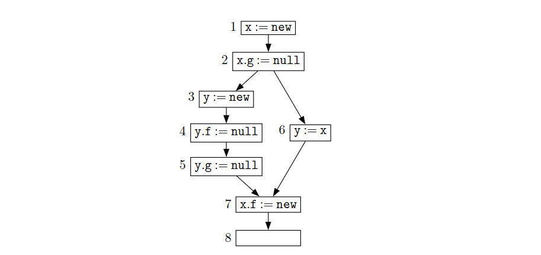
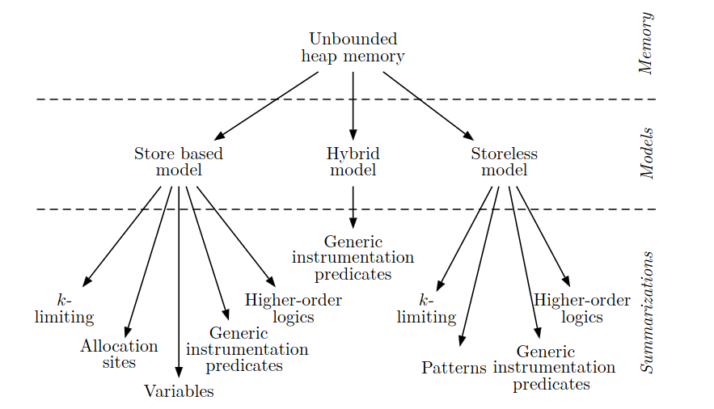
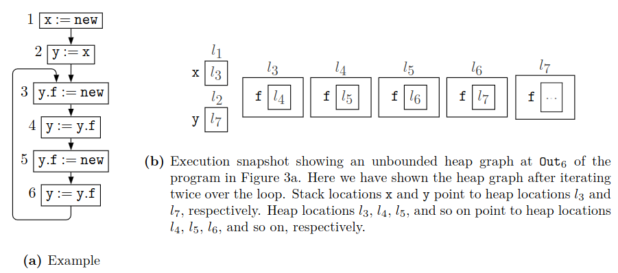
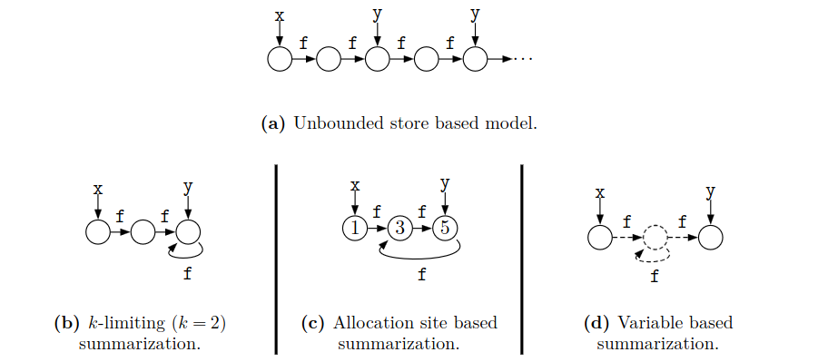
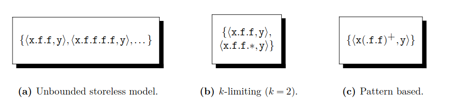
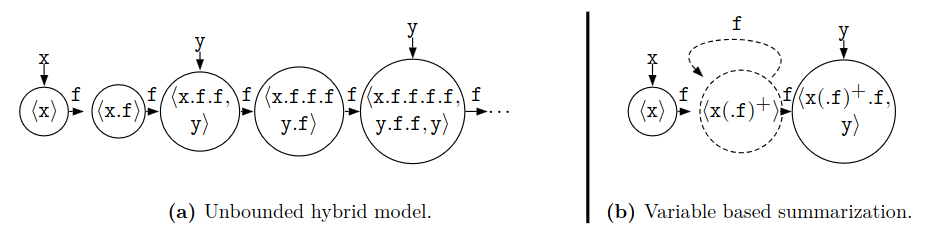

# Heap Abstractions for Static Analysis

本综述旨在探寻现有堆抽象描述中的统一主线

我们将堆抽象视为由两个要素组成：一是用于表示堆内存的**堆模型 (heap model)**，二是用于限制堆表示规模的**概括技术 (summarization technique)**

我们将模型划分为：无存储模型 (storeless)、基于存储的模型 (store-based) 以及混合模型 (hybrid)。我们还介绍了基于 $k$-受限 ($k$-limiting)、分配点 (allocation sites)、模式 (patterns)、变量 (variables)、其他通用谓词 (generic instrumentation predicates) 以及高阶逻辑 (higher-order logics) 的各种概括技术。

### 1. 堆分析的动机

#### 1.1 why heap?

 与栈 (stack) 或静态内存 (static memory)  不同，堆内存允许基于程序中的语句（而不仅仅是变量声明）进行按需内存分配。因此，它能够方便地创建灵活的数据结构，这些结构不仅可以脱离创建它们的函数（procedures）而独立存在，而且其大小还能在程序执行过程中发生变化。随着处理器速度的提升，内存容量的增大以及读写速度的加快，创建大型且灵活的数据结构的能力也随之增强。因此，堆内存无论是在用户程序中，还是在编程语言的设计与实现中，其作用都变得愈发重要。

#### 1.2 why heap analysis?

从广义上讲，堆分析提供了关于堆数据（即堆指针或引用）的有用信息。此外，它还有助于解析动态调度（dynamic  dispatch）过程中的控制流。堆分析所能支持的具体应用领域包括：程序理解、程序重构、验证、调试、安全性增强、性能提升、编译时垃圾回收、指令调度、并行化等。此外，在各种应用场景中，堆分析需要回答的问题还包括：堆变量是否指向空（null），程序是否存在内存泄漏，两个指针表达式是否别名（aliased），某个堆位置是否可从某个变量访问（reachable），两个数据结构是否不相交（disjoint），以及其他许多问题。第 8 节将概述堆分析的应用场景。

#### 1.3 why heap abstraction?

原因在于堆内存具有以下特征所决定的时间和空间结构：

*   **不可预测的生命周期 (Unpredictable lifetime)**：堆对象的生命周期并不局限于其创建所在的作用域。虽然在静态分析中很容易发现堆对象的创建，但却很难发现堆对象的最后一次使用，因此也就难以确定其最合适的销毁（deallocation）时机。
*   **无界的分配数量 (Unbounded number of allocations)**：堆位置是作为某些语句执行的结果按需创建的。由于这些语句可能出现在循环或递归过程中，堆分配数据结构的大小可能是无界的。此外，由于编译时无法预知执行顺序，堆表现出一种任意的结构。
*   **未命名的位置 (Unnamed locations)**：堆位置在程序中无法直接命名，只能命名指向它们的指针。因此，对操作堆的程序进行编译时分析，需要为堆内存位置创建合适的符号名（symbolic names）。这并非易事，因为与栈和静态数据不同，符号名与内存位置之间的关联无法保持固定。

#### tem

第 2 节介绍基本概念。第 3 节从模型和概括技术的角度定义了堆抽象。我们将堆模型归纳为无存储模型 (storeless)、基于存储的模型  (store-based) 和混合模型 (hybrid)，并描述了各种概括技术。这些通用概念随后在第 4、5 和 6  节中被使用，通过堆模型与概括技术之间的相互作用，来梳理相关的研究文献。第 7 节对比了这些模型和概括技术，探讨了设计选择并提供了一些指导原则。第 8 节描述了主要的堆分析技术及其应用。第 9 节提到了堆分析中一些值得注意的工程近似方法。第 10  节重点介绍了一些关于堆分析的文献综述论文和书籍章节。第 11 节总结了全文，并对整体趋势进行了展望。附录 A 对比了 C/C++ 和 Java  的堆内存视图。

### 2. 基本概念

#### 2.1 堆相关信息的示例 (Examples of Heap Related Information)

堆信息中最重要的两个例子是**别名关系 (aliasing)** 和 **指向关系 (points-to relations)**，因为其他大部分问题通常都是通过它们来解答的。

*   **别名分析 (Alias analysis)**：如果两个指针表达式的求值结果为同一组内存位置，则称它们互为别名（aliased）。对于两个指针表达式之间的别名关系，存在三种可能的情况：
    *   在程序的任何执行实例中，这两个指针表达式**绝不可能**是别名（cannot alias）。
    *   在程序的每一次执行实例中，这两个指针表达式**必然**是别名（must alias）。
    *   在某些执行实例中它们可能是别名，但在其他执行实例中则不一定（may alias）。

*   **指向分析 (Points-to analysis)**：旨在确定指针所持有的地址。指向信息同样有三种可能的情况：**必然指向 (must-points-to)**、**可能指向 (may-points-to)** 以及 **绝不指向 (cannot-points-to)**。

如果一个分析在处理涉及左值间接寻址（例如 C 语言中的 `*x` 或 `x->n`，或者 Java 中的 `x.n`）的赋值语句时，能够移除部分已有的别名或指向信息，则称该分析执行了**强更新 (strong update)**。如果无法移除任何信息，则称其执行了**弱更新 (weak update)**。强更新需要利用必然别名 (must-alias) 或必然指向 (must-points-to) 信息，而弱更新可以在流敏感分析 (flow-sensitive analysis) 中利用可能别名 (may-alias) 或可能指向 (may-points-to) 信息来执行。

#### 2.2 堆分析的正确性与精度 (Soundness and Precision of Heap Analysis)

静态分析计算出的信息旨在表征被分析程序的运行时行为。程序静态分析中两个重要的考量因素是**正确性 (soundness)** 和 **精度 (precision)**。正确性保证了程序所有可能的执行效果都已被包含在计算出的信息中。精度则是对“伪信息（spurious information，即无法对应到任何实际程序执行实例的信息）”数量的一种定性衡量；伪信息越少，信息就越精确。

当分析计算的信息必须在程序的所有执行实例中成立时，通过信息的**欠近似 (under-approximation)** 来确保正确性。当分析计算的信息可能仅在某些执行实例中成立时，通过信息的**过近似 (over-approximation)** 来确保正确性。精度则取决于过程中引入的过近似或欠近似的程度。

以图中的程序为例。考虑一个“可能为空 (may-null)”或“必然为空 (must-null)”的分析，其结果是一组指针集合，这些指针在语句 8 处可能（或必然）为空，从而报告可能出现（或必然出现）的空指针解引用。假设我们仅关注集合 `{x.f, x.g, y.f, y.g}`。我们知道 `x.g` 和 `y.g` 在程序的所有执行路径上都保证为空。然而，由于语句 7 的赋值，`x.f` 保证不为空；而 `y.f` 是否为空则取决于程序的具体执行。

(a) 考虑分析在语句 8 处报告的集合 `{x.g, y.g}`。该集合：
*   对于“必然为空”分析是**正确**的，因为它包含了所有在语句 8 处保证为空的指针。由于它只包含了这些指针，它也是**精确**的。对此集合的任何欠近似（即真子集）对于“必然为空”分析来说虽然是正确的，但不精确。对此集合的任何过近似（即真超集）对于“必然为空”分析来说是**不正确**的，因为它会包含一个不能保证为空的指针（如下文 (b) 所述）。
*   对于“可能为空”分析是**不正确**的，因为它排除了 `y.f`，而 `y.f` 在语句 8 处可能是空的。

(b) 另一方面，分析在语句 8 处报告的集合 `{x.g, y.g, y.f}`：
*   对于“可能为空”分析是**正确**的，因为它包含了所有在语句 8 处可能为空的指针。由于它只包含了这些指针，它也是**精确**的。对此集合的任何过近似（即真超集）对于“可能为空”分析来说是正确的，但不精确。对此集合的任何欠近似（即真子集）对于“可能为空”分析来说是**不正确**的，因为它会排除一个可能是空的指针（如上文 (a) 所述）。
*   对于“必然为空”分析是**不正确**的，因为它包含了 `y.f`，而 `y.f` 在语句 8 处并不保证为空。

### 3. 堆抽象

#### 3.1 定义堆抽象 (Defining Heap Abstractions)

将堆抽象定义为**堆建模 (heap modeling)** 与 **堆概括 (summarization of the heap memory)** 的结合：

- 我们将程序运行时的内存快照称为“具体内存 (concrete memory)”。**堆模型 (heap model)** 是对一个或多个具体内存的表征。它抽象掉不重要的细节，保留与特定应用或分析相关的信息。例如，在抽象内存模型中，可能只保留可达状态  (reachable states)。我们将这些模型分类为无存储模型 (storeless)、基于存储的模型 (store-based)  和混合模型 (hybrid)
- 通常情况下，对于非平凡程序 (non-trivial programs)，推导其精确的运行时信息在有限的时间和内存内是不可计算的（**莱斯定理，Rice's theorem**）。因此，在对堆信息进行静态分析时，我们需要对建模后的信息进行**概括 (summarization)**。概括过程应满足以下关键要求：(a) 使问题具有可计算性；(b) 计算出对应于任何运行时实例的正确近似 (sound approximation)；(c) 保留应用所需的足够精度。这些概括技术基于分配点 (allocation sites)、$k$-受限 ($k$-limiting)、模式 (patterns)、变量 (variables)、其他通用插桩谓词 (generic instrumentation predicates) 或高阶逻辑 (higher-order logics) 进行分类

#### 3.2 堆建模

示例程序和堆内存执行快照

这里展示了循环两次的堆图，栈位置 x 和 y 分别指向堆位置 $l_3$ 和 $l_7$。堆位置 $l_3、l_4、l_5$ 等分别指向堆位置 $l_4、l_5、l_6$ 等

- **基于存储的模型 (Store based model)**
  - 该模型通过地址来显式描述堆位置，通常将堆内存表示为一张有向图。图中的节点代表内存中的位置或对象。图中的边 $x \rightarrow o_1$ 表示指针变量 $x$ 可能持有对象 $o_1$ 的地址。由于对象可能包含持有地址的字段，我们也可以使用带标签的边 $x \xrightarrow{f} o_1$，表示对象 $x$ 的字段 $f$ 可能持有对象 $o_1$ 的地址。设 $V$ 为根变量集合，$F$ 为字段名集合，$O$ 为堆对象集合。那么，具体堆内存图可以看作是两个映射的集合：$V \mapsto O$ 和 $O \times F \mapsto O$。注意，该形式化假设 $O$ 不是固定的且是无界的，正是这一特性使得概括技术成为必要。
  - 但是抽象堆内存图是具体内存图的近似，一个变量或字段指向的是**对象的集合**，所以映射中的值域必须扩展为 $2^O$（幂集），抽象内存图可以看作是映射集合 $V \mapsto 2^O$ 和 $O \times F \mapsto 2^O$
  - 对于示例程序和堆，使用基于存储的模型来表示就是：
    
    图节点内的数字表示示例程序中对象的分配位置

- **无存储模型 (Storeless model)**
  - 无存储模型将堆视为**访问路径 (access paths)** 的集合。访问路径由一个指针变量后跟一系列结构体字段序列组成。具体和抽象堆内存的所需属性都以访问路径上的关系形式存储。无存储模型不显式地表达这些访问路径对应的内存位置或对象。给定根变量集 $V$ 和字段变量名集 $F$，访问路径集被定义为 $V \times F^*$。例如，访问路径 `x.f.f.f.f` 表示从 $x$ 出发经过四次 $f$ 字段间接寻址可达的内存位置。请注意，访问路径的数量可能是无限的，且每条访问路径的长度也是无界的，正是这一特性使得概括技术成为必要。
  - 对于示例程序和堆，使用无存储模型来表示就是：
    
    别名信息被存储为包含互为别名的访问路径的等价类集合。在 $Out_6$ 处，访问路径 `x.f.f.f.f` 和 `y` 被置于同一个等价类中，因为它们在程序执行的某个时刻互为别名

- **混合模型 (Hybrid model)**
  - Chakraborty 描述了一种混合堆模型，它结合了基于存储和无存储模型来表示堆结构。该模型既存储对象（如同基于存储的模型），也存储访问路径（如同无存储模型）
  - 对于示例程序和堆，使用混合模型来表示就是：
    

#### 3.3 堆概括