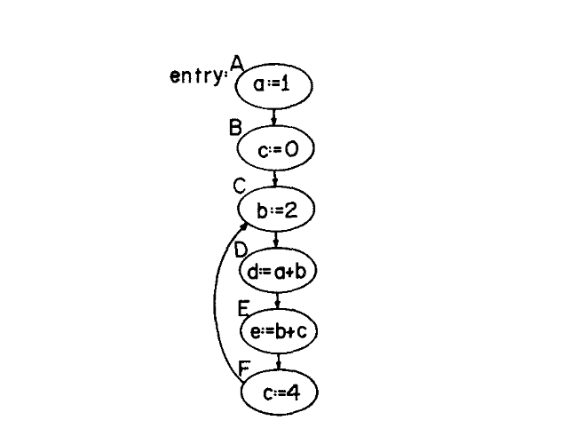

## A Unified Approach to Global Program Optimization

### 摘要

本文提出了一种对程序结构进行全局分析的技术，旨在对为表达式生成的目标代码执行编译时优化。所提出的全局表达式优化包括常量传播、公共子表达式消除、冗余寄存器加载操作的消除，以及活跃表达式分析。本文开发了一种通用的程序流分析算法，该算法依赖于“优化函数”的存在。该算法使用程序流结构的有向图模型进行了形式化定义，并被证明是正确的。本文定义了几个优化函数，当这些函数与流分析算法结合使用时，可提供各种形式的代码优化。该流分析算法具有充分的通用性，因此可以轻松地为其他形式的全局代码优化定义额外的函数。

### 1. 引言

已经发展出了许多针对程序结构的编译时分析技术，目的是定位冗余计算、执行常量计算，以及减少内存与高速寄存器之间的存储-加载序列数量。其中一些技术仅提供对直线型指令序列的分析[5,6,9,14,17,18,19,20,27,29,34,36,38,39,43,45,46]，而其他技术则将程序的分支结构考虑在内[2,3,4,10,11,12,13,15,23,30,32,33,35]。本文旨在描述一种单一的程序流分析算法，该算法将所有这些针对直线型代码的优化技术进行了扩展，使其能够包含分支结构。本文对该算法进行了形式化的描述，并证明了其正确性。此外，还讨论了该流分析算法在实际编译器中的实现。

本文所使用的方法将在下一节中阐明动机。

### 2. 常量传播

当在编译时对常量计算进行求值时，就会出现程序分析和优化的一个相当简单的情况。这个过程被称为“常量传播”或“折叠（folding）”。考虑以下 ALGOL 60 程序骨架：

```algol
    begin integer i,a,b,c,d,e;
    a:=1; c:=0; . . .
    for i:=1 step 1 until 10 do
        begin b:=2; . . .
        d:=a+b; . . .
        e:=b+c; . . .
        c:=4;   . . .
        end
    end
```

该程序由图 1 所示的有向图表示（忽略控制 for 循环的计算）。有向图的节点表示不包含备选程序分支的指令序列，而图的边表示执行时节点之间程序控制流的可能性。



（图 1. 对应于包含一个循环的 ALGOL 60 程序的程序图。）

出于常量传播的目的，将传播常量的“池（pool）”与图中的每个节点关联起来是很方便的。该池是一组有序对的集合，这些有序对指示在遇到该节点时具有常量值的变量。因此，节点 B 处的常量池（记为 $P_B$）仅由单个元素 (a,1) 组成，因为在程序执行期间，节点 A 处的赋值 a:=1 必须在遇到节点 B 之前发生。

基本的全局分析问题是为任意程序图中的每个节点确定传播常量池。通过观察图 1 的图，每个节点的常量池为：

$P_A = \emptyset$
$P_B = \{(a,1)\}$
$P_C = \{(a,1)\}$
$P_D = \{(a,1), (b,2)\}$
$P_E = \{(a,1), (b,2), (d,3)\}$
$P_F = \{(a,1), (b,2), (d,3)\}$

在一般情况下，可以通过以下方式为图中的每个节点 N 确定 $P_N$。考虑从入口节点 A 到节点 N 的每一条路径 (A, $p_1$, $p_2$, ..., $p_n$, N)。贯穿此路径应用常量传播，以获得仅针对此路径在节点 N 处的传播常量集合。由于在执行时不知道会采取哪条路径，因此为到达 N 的每条路径确定的传播常量的**交集**，就是出于优化目的可以假定的常量集合。

例如，图 1 中节点 D 处的传播常量池可以如下确定。从入口节点 A 到节点 D 的一条路径是 (A,B,C,D)。仅考虑这条路径，$P_D$ 的“第一次近似”为

$P_D^1 = \{(a,1), (b,2), (c,0)\}$

从 A 到 D 的一条更长的路径是 (A,B,C,D,E,F,C,D)，它导致对应于到达 D 的这条特定路径的常量池为

$P_D^2 = \{(a,1), (b,2), (c,4), (d,3), (e,2)\}$

可以评估从 A 到 D 越来越长的路径，对于任意大的 n，会得到 $P_D^3, P_D^4, \dots, P_D^n$。无论发生哪种控制流都可以假定的传播常量池，是所有 $P_D^i$ 共有的常量集合；即，

$P_D = \bigcap_{\forall i} P_D^i$

然而，此过程并非有效，因为在任意有向图的情况下，此类路径的数量可能没有有限的界限。因此，该过程不一定会停止。下一节的算法的目的就是在有限的步骤内计算出这个交集。

### 3. 全局分析算法

对图1中程序图的分析，为全局常量传播问题提供了一种启发式的解决方案。考虑节点C，通过沿着路径 (A,B,C) 传播常量，可以得到对 $P_C$ 的第一次近似，结果为
$$P_C^1 = \{(a,1), (c,0)\}.$$

基于这个近似池，可以确定后续节点的第一次近似：
$$P_D^1 = \{(a,1), (c,0), (b,2)\},$$
$$P_E^1 = \{(a,1), (c,0), (b,2), (d,3)\},$$
$$P_F^1 = \{(a,1), (c,0), (b,2), (d,3), (e,2)\}.$$

使用 $P_F^1$，由节点F进入节点C产生的常量池为
$$P = \{(a,1), (b,2), (d,3), (e,2), (c,4)\}.$$

然而请注意，由于
$$P_C = \bigcap_{\forall i} P_C^i$$
因此可知 $P_C \subseteq P_C^1 \cap P_C^2$。因此，我们不假定 $P_C^2 = P$，而是将 $P_C$ 的第二次近似取为
$$P_C^2 = P_C^1 \cap P = P_C^1 \cap \{(a,1), (b,2), (d,3), (e,2), (c,4)\} = \{(a,1)\}.$$

使用 $P_C^2$，再次完整追踪通过C之后的循环回路。然后可以基于 $P_C^2$ 确定后续节点的下一次近似：
$$P_D^2 = P_D^1 \cap \{(a,1), (b,2)\} = \{(a,1), (b,2)\},$$
$$P_E^2 = P_E^1 \cap \{(a,1), (b,2), (d,3)\} = \{(a,1), (b,2), (d,3)\},$$
$$P_F^2 = P_F^1 \cap \{(a,1), (b,2), (d,3)\} = \{(a,1), (b,2), (d,3)\}.$$

再次从节点F到节点C继续绕循环执行，第三次近似池 $P_C^3$ 被确定为
$$P_C^3 = P_C^2 \cap \{(a,1), (b,2), (d,3)\} = \{(a,1)\}.$$

显然，如果再次遍历该回路，后续的近似池将不会发生任何变化，因为 $P_C^3 = P_C^2$，并且 $P_C^2$ 对回路中各池的影响已经被考察过了。因此，分析停止，并且在每个节点处的最后一次近似池将作为最终的常量池。请注意，这些最后的近似与之前通过观察确定的常量池是一致的。

基于这些观察，可以非正式地陈述一种**全局分析算法**。

1. 从程序图中的一个入口节点开始，连同与该入口节点对应的给定入口池。通常只有一个入口节点，且入口池为空。
2. 处理该入口节点，并生成优化信息（在本例中，即一组传播的常量），将其发送给该入口节点的所有直接后继节点。
3. 将传入的优化池与后继节点处已建立的优化池进行交集运算（如果这是首次遇到该节点，则将传入的池作为第一次近似，并继续处理）。
4. 考虑每个后继节点，如果由于该交集运算导致优化信息的数量减少（或者如果是首次遇到该节点），则以与初始入口节点相同的方式处理该后继节点（后继节点被处理的顺序并不重要）。

为了概括上述概念，定义一个“优化函数” $f$ 是很有用的，它**将一个“输入”池连同一个特定节点映射到一个新的“输出”池**。例如，给定一组特定的传播常量，可以检查在特定节点处的操作，并确定在该节点执行后可以假定的传播常量集合。在常量传播的情况下，该函数可以非正式地表述如下。令 $V$ 为变量的集合，令 $C$ 为常量的集合，并令 $\underline{N}$ 为正在分析的图中的节点集合。集合 $U = V \times C$ 表示可能出现在任何常量池中的有序对。事实上，所有常量池都是 $U$ 的幂集（即 $U$ 的所有子集的集合）的元素，记为 $P(U)$。因此，
$$f: \underline{N} \times P(U) \rightarrow P(U),$$
其中 $(v,c) \in f(N,P) \iff$
a. $(v,c) \in P$ 且节点N处的操作未给变量v赋予新值，或者
b. 节点N处的操作将一个表达式赋值给变量v，并且基于P中的常量，该表达式求值为常量c。

> $(v,c) \in f(N,P)$ 是啥意思?
>
> *   **$(v, c)$**：一个有序对。$v$ 代表程序中的某个变量（比如变量 `x`），$c$ 代表一个具体的常数值（比如 `5`）。所以 `(x, 5)` 就表示“变量 x 的值是 5”。
> *   **$P$**：输入常量池（Input Pool）。它是在**进入**节点 $N$ 之前，我们已经确认的常量集合。比如 $P = \{(x, 5), (y, 2)\}$。
> *   **$N$**：程序图中的一个节点（通常是一段没有分支的直线型代码/基本块）。
> *   **$f(N, P)$**：就是作者所说的“优化函数”（在现代编译器理论中，这被称为**转移函数 Transfer Function**）。它接收节点 $N$ 和输入池 $P$，经过 $N$ 里面的代码计算后，吐出一个**新的、输出的常量池**。

例如，考虑图1的图。可以将优化函数应用于具有空常量池的节点A，产生
$$f(A,\emptyset) = \{(a,1)\}.$$
类似地，函数 $f$ 可以应用于具有 $\{(a,1)\}$ 作为常量池的节点B，产生
$$f(B, \{(a,1)\}) = \{(a,1), (c,0)\}.$$
请注意，给定从入口节点A到任意节点 $N \in \underline{N}$ 的一条特定路径，**可以为该路径假定的优化池是通过复合函数 $f$ 直到该路径的最后一个节点来确定的**。例如，给定路径 (A,B,C,D)，
$$f(C, f(B, f(A,\emptyset))) = \{(a,1), (c,0), (b,2)\}$$
就是D节点处针对这条路径的常量池。

在正在分析的图中，任意节点N处的优化信息池，独立于执行时所采取的路径，现在可以形式化地表述为
$$P_N = \bigcap_{x \in F_N} x$$
其中
$$F_N = \{f(p_n, f(p_{n-1}, \dots, f(p_1, P))\dots) \mid (p_1, p_2, \dots, p_n, N) \text{ 是从带有对应入口池 P 的入口节点 } p_1 \text{ 到节点 N 的路径}\}.$$

> 这里就是 **MOP**

在形式化地陈述全局分析算法之前，有必要澄清一些基本概念。

一个有限有向图 $G = \langle \underline{N}, \underline{E} \rangle$ 是由“节点”构成的任意有限集合 $\underline{N}$ 以及“边”构成的有限集合 $\underline{E} \subseteq \underline{N} \times \underline{N}$。在G中从A到B的“路径”（对于 $A,B \in \underline{N}$），是一个节点序列 $(p_1, p_2, \dots, p_k) \ni p_1 = A$ 且 $p_k = B$，其中 $(p_i, p_{i+1}) \in \underline{E} \quad \forall i, 1 \le i < k$。路径 $(p_1, p_2, \dots, p_k)$ 的“长度”为 $k-1$。

“程序图”是一个有限有向图G，连同一个非空的“入口节点”集合 $\mathcal{E} \subseteq \underline{N}$，使得给定 $N \in \underline{N}$，存在一条路径 $(p_1, \dots, p_n) \ni p_1 \in \mathcal{E}$ 且 $p_n = N$（即，从某个入口节点出发，存在一条到达图中每个节点的路径）。

节点N的“直接后继”集合由下式给出：
$$I(N) = \{N' \in \underline{N} \mid (N, N') \in \underline{E}\}.$$
类似地，N的“直接前驱”集合由下式给出：
$$I^{-1}(N) = \{N' \in \underline{N} \mid (N', N) \in \underline{E}\}.$$

令有限集 $\underline{P}$ 为针对给定应用的所有可能的优化池的集合（例如，在常量传播的情形中 $\underline{P} = P(U)$，其中 $U = V \times C$），且令 $\wedge$ 为具有以下性质的“交（meet）”运算：
$$\wedge: \underline{P} \times \underline{P} \rightarrow \underline{P},$$
$$x \wedge y = y \wedge x \quad (\text{交换律}),$$
$$x \wedge (y \wedge z) = (x \wedge y) \wedge z \quad (\text{结合律}),$$
其中 $x, y, z \in \underline{P}$。集合 $\underline{P}$ 与 $\wedge$ 运算定义了一个有限交半格（finite meet-semilattice）。

> 有限交半格是什么?
>
> - "有限": 信息池集合 $\underline{P}$ 的大小（或者说这个半格的深度）是**有限的**
> - "交半格": 
>   - 如果有两种运算：既能求“最大下界（交，$\wedge$）”，又能求“最小上界（并，$\vee$）”，就叫一个**完整的“格”**
>   - 但在这里，编译器在控制流分析时，**只需要一个方向的合并操作**（寻找保守的共同点 $\wedge$），根本用不到另一种发散的操作（$\vee$）。因为只用到了格理论的一半性质，所以被称作**“半格（Semilattice）”**

$\wedge$ 运算在 $\underline{P}$ 上定义了一个偏序关系，由下式给出：
$$x \le y \iff x \wedge y = x \quad \forall x,y \in \underline{P}.$$
类似地，
$$x < y \iff x \le y \text{ 且 } x \neq y.$$

给定 $X \subseteq \underline{P}$，广义的交运算 $\bigwedge_{x \in X} x$ 被简单地定义为将 $\wedge$ 成对地应用于 $X$ 的元素。假定 $\underline{P}$ 包含一个“零元素” $\underline{0} \ni \underline{0} \le x \quad \forall x \in \underline{P}$。通过向 $\underline{P}$ 添加一个具有属性 $\underline{1} \notin \underline{P}$ 且 $\underline{1} \wedge x = x \quad \forall x \in \underline{P}$ 的“单位元素” $\underline{1}$，可以构造一个增广集 $\underline{P}'$；$\underline{P}' = \underline{P} \cup \{\underline{1}\}$。由此得出 $x < \underline{1} \quad \forall x \in \underline{P}$。

> 上面 3 行是啥意思? 在干什么?
>
> - 这段话在解决一个问题：怎么给算法设定一个初始状态
> - “零元素“：是算法的“最保守的状态”，“是最保守的估计”。比如在常量传播中就是空集
> - “单位元素“：解决了：“我们**还没开始遍历路径**，此时我们该给它设置什么初始值？“这个问题
>   - 因为它 $\wedge$ 任何信息 $x$ 都会变成 $x$ 本身，所以它在算法中**不会干扰任何实际的计算结果**
> - 为什么要“增广”？
>   - 因为原本的集合 $\underline{P}$ 里可能根本没有这个“理想初值” $\underline{1}$（比如常量传播的池集合 $P(U)$ 里只有各种具体的集合。如果没有这个人为添加的 $\underline{1}$，我们就没法描述“尚未被分析”的节点。比如你说 $U$ 就是单位元素可以用这个初始化，那你遇到一个节点，发现它的优化集是 $U$ ，那它到底是还没被分析还是说分析了一圈就是 $U$ 呢？）

定义一个“优化函数” $f$
$$f: \underline{N} \times \underline{P} \rightarrow \underline{P}$$
并且它必须具有同态性质（homomorphism property）：
$$f(N, x \wedge y) = f(N,x) \wedge f(N,y), \quad N \in \underline{N}, x,y \in \underline{P}.$$
请注意 $f(N,x) < \underline{1} \quad \forall N \in \underline{N} \text{ 且 } x \in \underline{P}$。

> 这里在说啥？
>
> - $f(N, x \wedge y) = f(N,x) \wedge f(N,y), \quad N \in \underline{N}, x,y \in \underline{P}.$ 翻译成人话就是**在进入节点 $N$ 之前合并信息，和进入节点 $N$ 之后再合并信息，结果必须是一样的**
> - 为啥要有这个要求？如果这个性质不成立，编译器分析就会产生“歧义”。这意味着编译器如果改变了路径处理的先后顺序，或者在处理分支汇合点时采取了不同的合并策略，得出的优化结果就会不同。这在逻辑上是不能接受的——程序的优化结果必须是唯一的、确定的，不能依赖于编译器的实现细节。
> - 为什么它叫“同态”？
>   在抽象代数中，“同态”指的是一种“保持结构不变”的映射。
>   *   我们的“结构”是半格（$\underline{P}$ 以及上面的 $\wedge$ 运算）。
>   *   同态性质保证了 $f$ 这个函数（转移函数）能够**原样地穿透**交运算。它告诉我们，节点 $N$ 的处理逻辑是“线性的”或者“分布式的”，它**不关心自己处理的是原始数据还是已经合并过的数据**。


现在陈述全局分析算法：
**算法 A.** 对每个特定程序图G的分析取决于一个“入口池集合” $\underline{\mathcal{E}} \subseteq \mathcal{E} \times \underline{P}$，其中 $(e,x) \in \underline{\mathcal{E}}$ 表示 $e \in \mathcal{E}$ 是一个带有对应入口优化池 $x \in \underline{P}$ 的入口节点。

> *   **$\mathcal{E}$（Entry nodes）**：这是程序图中的“入口节点”集合。一般来说，对于一个函数，入口点通常只有一个（函数的起点）。
> *   **$\underline{\mathcal{E}}$（Entry pool set）**：这是一个“入口对”集合，即 `(入口节点, 入口池)` 的组合。
> *   **$(e, x) \in \underline{\mathcal{E}}$**：它的意思是，对于给定的程序图 $G$，我们明确规定了：“从节点 $e$ 开始分析，且在进入 $e$ 之前，我们假设的已知信息（优化池）是 $x$”。

A1[初始化]    $L \leftarrow \underline{\mathcal{E}}$
A2[终止？]    如果 $L = \emptyset$，则停机。
A3[选择节点]  令 $L' \in L$，$L' = (N, P_i)$ 对于某个 $N \in \underline{N}$ 且 $P_i \in \underline{P}$，$L \leftarrow L - \{L'\}$
A4[遍历？]    令 $P_N$ 为当前与节点N关联的优化信息的近似池（初始时，$P_N = \underline{1}$）。如果 $P_N \le P_i$ 则转到步骤A2。
A5[设置池]    $P_N \leftarrow P_N \wedge P_i$，$L \leftarrow L \cup \{(N', f(N, P_N)) \mid N' \in I(N)\}$。
A6[循环]      转到步骤A2。

> 这算法说啥呢？
>
> - $L$ 相当于任务清单
> - $A1$：初始化任务清单
> - $A2$：如果任务清单为空，就停机
> - $A3$：从任务清单 $L$ 中把任务 $L'$ 拿出来，其中 $P_i$ 是通过某条路径传给 $N$ 的优化信息
> - $A4$：看一下当前节点的优化信息的近似池 $P_N$ ，如果 $P_N \le P_i$ 也不用继续传播了
> - $A5$：
>   - **更新 $P_N \leftarrow P_N \wedge P_i$**：将旧结论和新来的信息取交集。结果一定会使 $P_N$ 变得更精确（或者说更小、更保守）。
>   *   **扩散 $L \leftarrow L \cup \dots$**：一旦 $P_N$ 更新了，意味着节点 $N$ 输出给后继节点的信息可能也会变。
>       *   通过转移函数 $f(N, P_N)$ 计算出节点 $N$ 处理完后的新结果。
>       *   把这个结果发给 $N$ 的所有直接后继节点 ($N' \in I(N)$)，并将它们放入清单 $L$ 中，等待下一次分析。

出于常量传播的目的，如同前面一样，$\underline{P} = P(U)$，其中 $U = V \times C$。交运算是 $\cap$，而小于或等于关系是 $\subseteq$。请注意，在这种情况下零元素是 $\emptyset \in P(U)$。在 $P(U)$ 中的单位元素是 $U$ 自身。然而，算法需要一个新的单位元素，该元素不在 $P(U)$ 中。新的单位元素构造如下：令 $\delta$ 为一个不在 U 中的符号，并令 $\underline{U} = U \cup \{\delta\}$。由此得出 $U \cap x = x \quad \forall x \in P(U)$ 且 $\underline{U} \notin P(U)$。因此，$\underline{P}' = \underline{P} \cup \{\underline{U}\}$ 是通过向 $\underline{P}$ 添加一个单位元素 $\underline{U}$ 而获得的。正如定理2证明中所演示的那样，向 U 添加符号 $\delta$ 会使得算法A考虑程序图中的每个节点至少一次。

> 为啥要引入一个 $\underline{U}$ ？前面已经说过了

附录A展示了使用入口池集合 $\underline{\mathcal{E}} = \{(A,\emptyset)\}$ 对图1的程序图进行的分析。

**定理 1.** 算法A是有限的。
**证明.** 算法A在 $L = \emptyset$ 时终止。步骤A3的每一次求值都会从L中移除一个元素，而只有在步骤A5中才会向L中添加元素。因此，如果步骤A5求值的次数是有限的，则A是有限的。非正式地说，步骤A5的每一次求值都会减小某个节点N处的池 $P_N$ 的“大小”。由于大小不能小于 $\underline{0}$，因此该过程必然是有限的。形式上，仅当 $P_N \neq P_N \wedge P_i$ 时才执行步骤A5。但是 $(P_N \wedge P_i) \wedge P_N = P_N \wedge P_i \implies P_N \wedge P_i \le P_N$，并且 $P_N \wedge P_i \neq P_N \implies P_N \wedge P_i < P_N$。因此，在节点N处的近似池 $P_N$ 最多能被缩减到 $\underline{0}$，因为 $P_N \leftarrow P_N \wedge P_i$。此外，由于 $P_N$ 的第一次近似是 $\underline{1}$，并且格是有限的，因此可以推断出步骤A5只能执行有限次。因此A是有限的。◼

算法A的步骤数上限很容易确定。令 $n$ 为 $\underline{N}$ 的基数，并令 $h(\underline{P}')$ 为 $\underline{P}'$ 的函数（其本身也可能是 $n$ 的函数），提供 $\underline{1}$ 和 $\underline{0}$ 在 $\underline{P}'$ 之间的任何链的最大长度。对于任何给定的节点，步骤A5最多可以执行 $h(\underline{P}')$ 次。由于程序图中有 $n$ 个节点，因此步骤A5被执行的次数不会超过 $n \cdot h(\underline{P}')$ 次。

在常量传播的情况下，例如，令 $u$ 为 $U$ 的基数。$U$ 的大小直接随节点数 $n$ 的变化而变化。此外，任何诸如 $u_1, u_2, \dots, u_k$（其中 $u_1 = U$ 且 $u_k = \emptyset$，且 $u_1 \supset u_2 \supset u_3 \dots \supset u_k$）的链的最大长度是 $u$。因此，$h(P(U)) = u$；理论上的边界是 $n \cdot u$。由于 $u$ 与 $n$ 成正比变化，由此可知算法A的阶不会比 $n^2$ 更糟。

算法A的正确性由以下定理保证。

**定理 2.** 令 $F_N = \{f(p_n, f(p_{n-1}, \dots, f(p_1, P))\dots) \mid (p_1, \dots, p_n, N) \text{ 是从带有相应入口池 P 的入口节点 } p_1 \text{ 到节点 N 的路径}\}$。进一步地，令
$$X_N = \bigwedge_{x \in F_N} x$$
对应于一个特定的程序图 $G$、集合 $\underline{P}'$，以及优化函数 $f$，它们均满足算法A的条件。如果当A停机时 $P_N$ 是与节点N关联的最终近似池，则 $P_N = X_N \quad \forall N \in \underline{N}$。

因此，定理2将算法的最终输出与之前得出的直观结果联系了起来。定理2的证明在附录B中给出。

定理2的一个有趣的副作用是，在步骤A3中从L中选择元素的顺序是任意的，如下面的推论所述。

**推论 1.** 算法A终止时与每个节点 $N \in \underline{N}$ 关联的最终池 $P_N$ 是唯一确定的，与步骤A3中从L中选取 $L'$ 的顺序无关。
**证明.** 该推论是直接得出的，因为附录B中定理2的证明独立于 $L'$ 的选择。◼

由于在步骤A3中从L中选取 $L'$ 的顺序是任意的，所以研究这种选择标准对算法的影响是一件很有趣的事情。到达最终解的步骤数显然会受到此选择的影响。然而，目前尚未建立起能使该收敛速率最大化的选择方法。人们还可以注意到，通过将步骤A3和A5中对L的访问视为临界区，可以并行地处理L的元素。也就是说，可以在步骤A3中启动独立的进程来分析L的所有元素。

此时需要着重指出的是，算法A允许人们忽略全局分析，而将注意力集中在开发直线型代码优化函数上。也就是说，如果能够为一个不包含替代分支的代码序列构造出优化函数f，那么只要f满足算法的条件，就可以调用算法A来执行分支分析。