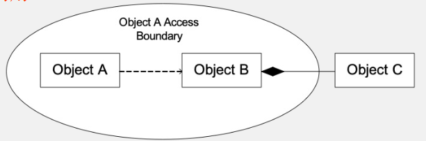

#### 单一职责原则（Single Responsibility Principle, SRP）

- **一个对象应该只包含单一的职责，并且该职责被完整地封装在一个类中**
- 就一个类而言，应该**仅有一个引起它变化的原因**
- 将变化与不变拆开
- 可变性封装原则

---

#### 开闭原则（Open-Closed Princle, OCP）

- 一个软件实体应当**对扩展开放，对修改关闭**
- 开闭原则还可以通过一个更加具体的**对可变性封装原则（Principle of Encapsulation of Variation, EVP）**来描述：**把变化封装起来，与不变隔离**

---

#### 里氏代换原则（Liskov Substitution Principle, LSP）

- **如果对每一个类型为 S 的对象 o1，都有类型为 T 的对象o2，使得以 T 定义的所有程序P在所有的对象 o2 都代换成 o1 时，程序P的行为没有变化，那么类型 S 是类型 T 的子类型**
- 所有引用基类（父类）的地方必须能透明地使用其子类的对象
- 里氏代换原则要求子类必须能够完美替换父类而不破坏程序逻辑；因此子类在重写父类方法时，**前置条件不能更严、后置条件不能更宽、抛出的异常范围不能更大（可以不抛）**，且必须遵守父类原有的业务契约

---

#### 依赖倒转原则(Dependence Inversion Principle, DIP)

- **高层模块不应该依赖低层模块，它们都应该依赖抽象。抽象不应该依赖于细节，细节应该依赖于抽象。**
- **要针对接口编程，不要针对实现编程**
- 依赖倒转原则保证了高层模块不会依赖（且无法直接调用）子类特有的公开方法
- 依赖倒转原则分析
  - 类之间的耦合：
    1. 零耦合关系：两个类之间没有任何直接的依赖关系
    2. 具体耦合关系：一个类**直接依赖于另一个具体的类**（而不是接口或抽象类）
    3. 抽象耦合关系：一个类**依赖于一个抽象（接口或抽象类）**，而不是具体的实现类

---

#### 接口隔离原则(Interface Segregation Principle, ISP)

- **客户端不应该依赖那些它不需要的接口**
- 一旦一个接口太大，则需要将它分割成一些更细小的接口，使用该接口的客户端仅需知道与之相关的方法即可。

---

#### 合成复用原则(Composite Reuse Principle, CRP)

- **尽量使用对象组合，而不是继承来达到复用的目的**
- 复用：
  - 白箱复用：知道实现细节（如：继承）
  - 黑箱复用：不知道实现细节（如：组合）
- 组合 vs 继承
  - 继承：静态、暴露父类细节、可以改变父类功能
  - 组合：动态、不暴露细节
  - 为啥组合类和类之间的偶合度低？从变化传播的角度来看，继承修改类时会传播变化到子类，传播范围大
  - 继承用来复用接口、组合用来复用实现

---

#### 最小知识原则（迪米特法则）(Law of Demeter, LoD)(Least Knowledge Principle, LKP)

- 不要和“陌生人”说话、只与你的直接朋友通信、每一个软件单位对其他的单位都只有最少的知识，而且局限于那些与本单位密切相关的软件单位

- 一个软件实体应当尽可能少的与其他实体发生相互作用

- 在狭义的迪米特法则中，如果两个类之间不必彼此直接通信，那么这两个类就不应当发生直接的相互作用，如果其中的一个类需要调用另一个类的某一个方法的话，可以通过第三者转发这个调用

  