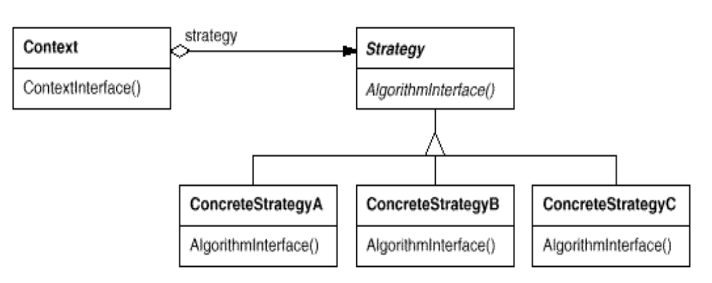

# 策略模式(Strategy Pattern | Policy Pattern)

**对象行为型**

#### 1. 目的

定义一系列算法，把它们一个个封装起来，并且他们之间可相互替换。策略模式使得算法可独立于使用它的客户端而变化。

#### 2. 设计原则

- 使用可变性封装原则
  - 体现在：
  
- 使用依赖倒转
  
- 使用合成复用原则

#### 3. 关键点

#### 4. 适用性（Applicability）

1. **当许多相关的类仅在“行为”上有所不同时**。策略模式提供了一种方式，可以用多个行为中的任意一个来配置一个类

2. **当你需要一个算法的不同变体时**。比如我们可能会定义一些反映不同“时间/空间权衡”（时空开销折中）的算法。当这些变体被实现为一个算法的类层次结构（Class Hierarchy）时，就可以使用策略模式

3. **当算法使用了客户端不该知晓的数据时。** 可使用策略模式来避免暴露那些复杂的、与特定算法相关的内部数据结构。

4. **当一个类定义了多种行为，并且这些行为在该类的操作中以多个条件语句（if-else 或 switch-case）的形式出现时。** 与其使用大量的条件分支，不如将相关的条件分支移入它们各自的策略类（Strategy class）中。

#### 5. 优缺点 & 结果

- **优点**
  1. 相关算法族：Strategy 类的层次结构定义了一系列的算法或行为供 Context 类重用。继承可以帮助题取出这些算法的通用功能。
  
  2. 子类化的一种替代方案：相比于直接对 Context 类做子类化，策略模式提供了一种更灵活的替代方案。
  
  3. 消除条件语句
  
  4. 实现方案的可选性：策略模式可以提供同一行为的不同实现方式。客户端可以根据不同时间与空间权衡选择策略。
  
- **缺点**
  1. 客户端必须了解不同的策略：策略模式会将策略暴露给客户端，可能会使客户端接触到具体的实现问题
  
  2. 策略和上下文之间的通信开销：在策略接口和上下文类之间传递信息会产生性能和代码复杂性的开销
  
  3. 增加了对象的数量

#### 6. 问题

$Q:$ 为啥设计模式没被建成一个库？

$A:$ 设计模式比库的层次更高，设计模式是告诉我们如何组织类和对象来解决某些问题

$Q:$ 库和框架是设计模式吗？

$A:$ 不是，他们提供的是链接到代码中的具体实现。

