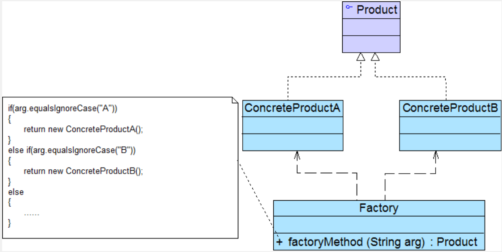
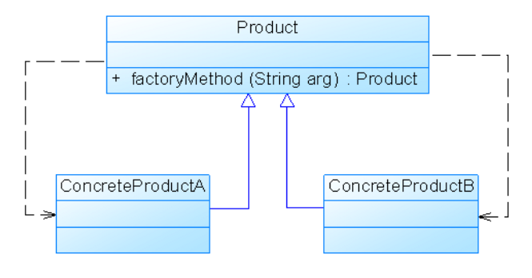

# 工厂

### 简单工厂(Simple Factory Pattern | Static Factory Method)

**类创建型**

#### 1. 目的

可以根据传入的参数返回对应类的实例

#### 2. 设计原则

- 使用单一职责
- 使用最小知识原则
- 使用依赖倒转原则

#### 3. 关键点

- 当你需要什么，只需要传入一个正确的参数，就可以获取你所需要的对象，而无须知道其创建细节。

#### 4. 适用性（Applicability）

1. 工厂类负责创建的对象比较少
2. 客户端只关心传入工厂类的参数，不关心如何创建对象

#### 5. 优缺点 & 结果

- **优点**

  1. 将对象的创建和对象本身业务处理分离，降低系统的耦合度，让两者修改起来都相对容易

  2. 客户端无需知道创建的具体产品的类名，只需要知道其对应参数

  3. 工厂方法是*静态方法*，使用起来很方便。（在实际开发中可以把要传入到工厂方法中的参数写在配置文件中，就该参数可以不用修改代码）

- **缺点**

  1. 工厂类的职责过重
     - 系统扩展困难：增加新的产品必须要修改工厂类的判断逻辑
     - 工厂类集中了所有产品的创建逻辑，一旦不能正常工作整个系统都会受到影响
  2. 简单工厂模式由于使用了静态工厂方法，造成工厂角色无法形成基于继承的等级结构
  3. 增加系统复杂度

#### 6. 问题

#### 7. 模式扩展

在有些情况下一个抽象产品类也可以作为子类的工厂，也就是说把静态工厂方法写到抽象产品类中

---

### 工厂方法(Factory Method Pattern) | 虚拟构造器(Virtual Constructor)模式 | 多态工厂(Polymorphic Factory)模式

**类创建型**

#### 1. 目的
工厂父类负责定义创建产品对象的公共接口，工厂子类负责生成具体的产品对象，这样就可以将产品类的实例化延迟到工厂子类中完成。

#### 2. 设计原则
符合开闭原则

#### 3. 关键点
- 在工厂模式中，核心工厂类不再负责所有产品的创建，而是将具体创建工作交给子类去做。
- 工厂方法处理对对象的创建，并将对象的创建封装在子类中，使得超类中的客户代码从子类的对象创建代码中解耦（head first）

- 工厂方法模式可以允许系统在不修改工厂角色的情况下引进新产品。

- 在实际开发中可以把具体工厂的实例化的类名写在配置文件中，通过反射再生成对象

#### 4. 适用性（Applicability）
1. **一个类不知道它所需要的对象的类**：在工厂方法模式中，客户端不需要知道具体产品类的类名，只需要知道所对应的工厂即可，具体的产品对象由具体工厂类创建；客户端需要知道创建具体产品的工厂类。
2. **一个类通过其子类来指定创建哪个对象**：在工厂方法模式中，对于抽象工厂类只需要提供一个创建产品的接口，而由其子类来确定具体要创建的对象，利用面向对象的多态性和里氏代换原则，在程序运行时，子类对象将覆盖父类对象，从而使得系统更容易扩展。
3. **将创建对象的任务委托给多个工厂子类中的某一个，客户端在使用时可以无须关心是哪一个工厂子类创建产品子类，需要时再动态指定**，可将具体工厂类的类名存储在配置文件或数据库中。

#### 5. 优缺点
- 优点：
    1. 用户只需关心所需产品对应的工厂，不用关心创建细节，也无需知道具体产品的类名
    
    2. 工厂可以自主确定创建何种产品对象，且创建产品的细节也完全封装在具体工厂内部

    3. 系统加入新产品时可以不修改抽象工厂和抽象产品提供的接口，也不用修改客户端和其他的具体工厂、具体产品
    
- 缺点：
    1. 添加新产品时既要写新的具体产品类还要写新的具体工厂类，类的数量成对增加，增加了系统复杂度
    
    2. 由于考虑到系统的可扩展性，需要引入抽象层，在客户端代码中均使用抽象层进行定义，增加了系统的抽象性和理解难度

#### 6. 问题

Q：只有一个 ConcreteFactory 时，工厂方法模式有什么优点？

A：工厂模式可以将产品的创建和使用解耦，而且如果添加产品或改变产品的创建不会影响到 Factory

Q：Factory 和工厂方法一定是抽象的吗？

A：不一定，因为可以定义一个缺省的工厂方法来生产一些具体产品

---

### 抽象工厂（Abstract Factory Pattern）（Kit 模式）

**对象创建型\***

#### 1. 概念

- 产品等级结构：产品等级结构即产品的继承结构
  - 比如一个抽象类是电视机，其子类有海尔电视机、海信电视机、TCL电视机，则抽象电视机与具体品牌的电视机之间构成了一个产品等级结构
- 产品族：是指由同一个工厂生产的，位于不同产品等级结构中的一组产品
  - 比如海尔电视、海尔冰箱

#### 2. 目的

提供一个创建一系列相关或相互依赖对象的接口，而无须指定它们具体的类。

#### 3. 设计原则

#### 4. 关键点

- 抽象工厂与工厂方法的不同点：
  - 工厂模式面对的是一个产品结构，抽象工厂模式面对的是多个产品结构
  - 工厂方法是通过继承，抽象工厂是通过组合来创建对象

- 开闭原则的倾斜性

#### 5. 适用性（Applicability）

1. 一个系统不应当依赖于产品类实例如何被创建、组合和表达的细节，这对于所有类型的工厂模式都是重要的
2. 系统中有多于一个的产品族，而每次只使用其中某一产品族
3. 属于同一个产品族的产品将在一起使用
4. 系统提供一个产品类的库，所有的产品以同样的接口出现，从而使客户端不依赖于具体实现

#### 6. 优缺点

- **优点：**
  1. 抽象工厂模式**隔离了具体类的生成**，使得客户并不需要知道什么被创建
  2. 使用抽象工厂可以达到高内聚低耦合的设计目的，只需要改变具体工厂的实例就能改变系统的行为
  3. 当一个产品族中的多个对象被设计成一起工作时，他能保证客户端始终使用同一个产品族中的对象
  4. 不用修改现有系统就能增加新的具体工厂和产品族，符合开闭
- **缺点：**
  1. 难以扩展抽象工厂来生产新种类的产品
  2. 开闭原则的倾斜性：增加新的工厂和产品族容易，增加新的产品等级结构麻烦

#### 7. 问题
